# behaviac学习笔记

[TOC]

## 原始教程
URL:[http://www.behaviac.com/language/zh/category/%E6%96%87%E6%A1%A3/%E6%95%99%E7%A8%8B/](http://www.behaviac.com/language/zh/category/%E6%96%87%E6%A1%A3/%E6%95%99%E7%A8%8B/)

## 例子

### 编辑器

1. 新建行为树
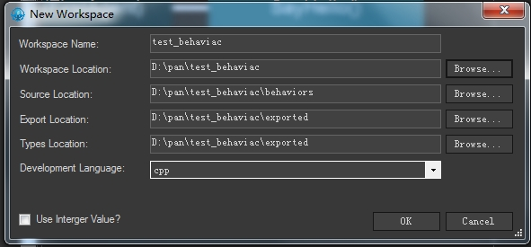
2. 新增Agent
	1. `视图`->`类型信息(Ctrl+M)`
	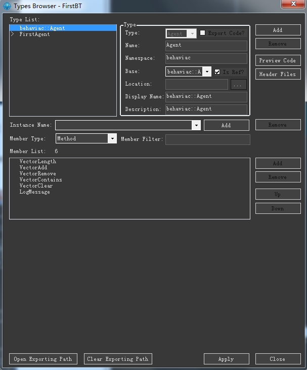
	2. `add`
	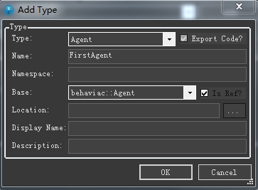
	3. 新增方法
	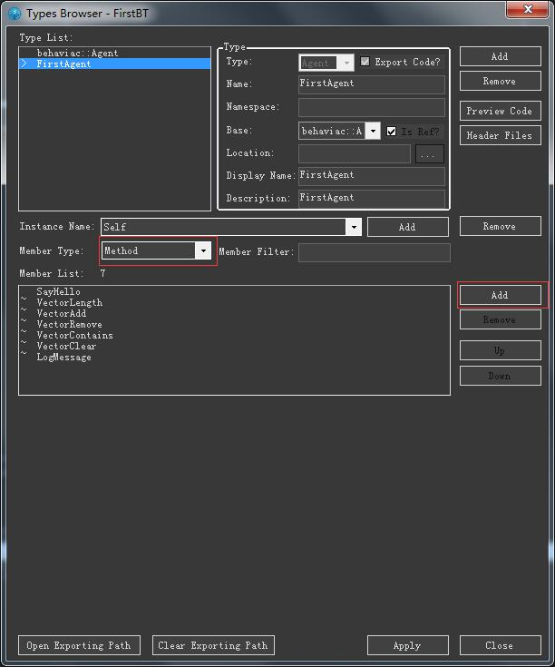
	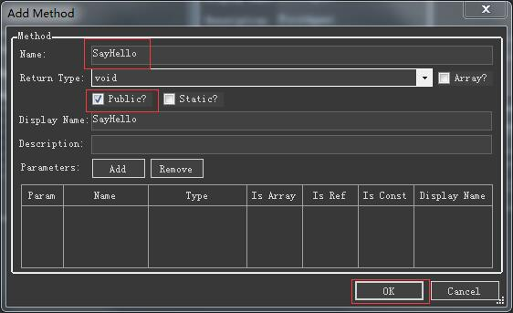
	4. 生成的文件结构
	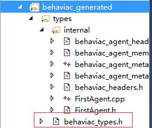

	文件名 | 说明
	-|
	behaviac_types.h | 为需要在代码中包含的头文件
	internal | 文件夹内的文件为"胶水"代码文件.
	internal/behaviac_agent_member_visitor.h | 生成了用于访问类的私有属性和方法的“胶水”代码
	internal/behaviac_agent_meta.h/cpp | 文件生成了用于注册类及其属性、方法、实例等信息的“胶	水”代码，这些“胶水”代码主要是为了程序端可以通过名字自动取用到类及其成员属性、方法及其实例等。
3. 创建行为树

改名
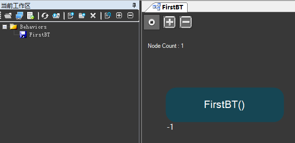
4. 修改行为树
	1. 鼠标左键单击选中该根节点，为该节点的“Agent类型”设置为前面创建的“FirstAgent”，表示这棵行为树用来描述FirstAgent类的行为
	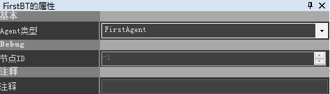
	2. 设置完后，可以发现根节点已经具有类型“FirstAgent
	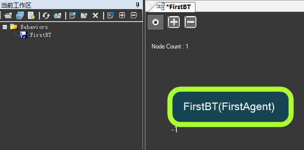
	3. 在左侧的节点列表中（如下图所示），用鼠标左键选中“动作”节点（或其他需要的节点）后，按住鼠标左键并拖拽该节点到右侧的主视口中，并将动作节点落在根节点右侧的黑色三角箭头处
	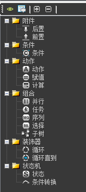
	4. 选中该动作节点，在右侧“动作的属性”窗口中，为其选择成员方法“SayHello”，并将另一参数“决定状态的选项”设置为“Success
	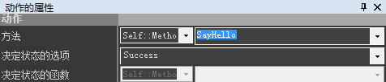
	5. 至此，我们得到了一棵最简单但是完整的行为树
	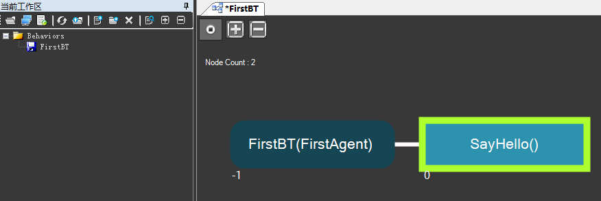
5. 导出行为树
编辑完行为树后，需要导出全部行为树，以便程序端加载使用。
	1. 点击工具栏中的“导出全部”按钮
	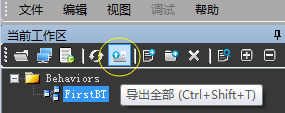
	2. 弹出“导出”窗口，在导出格式中暂只用勾选“Xml”，点击右下方的“导出”按钮
	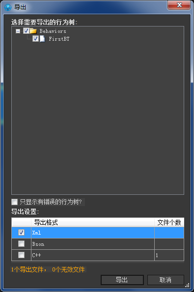
	3. 导出后，打开工作区中指定的导出目录，可以看到成功导出了FirstBT.xml文件和meta文件夹中的tutorial_1_cpp.meta.xml文件，如下图所示
	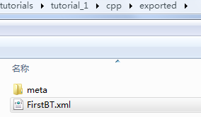
	导出的FirstBT.xml文件就是交给程序端加载使用的行为树，tutorial_1_cpp.meta.xml文件是交给程序端加载使用的含有类型和自定义成员属性信息的文件。

### 代码
1. 增加include目录
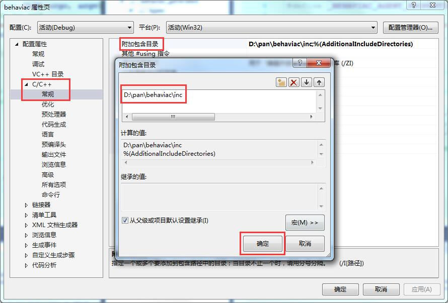
2. 增加引用库文件
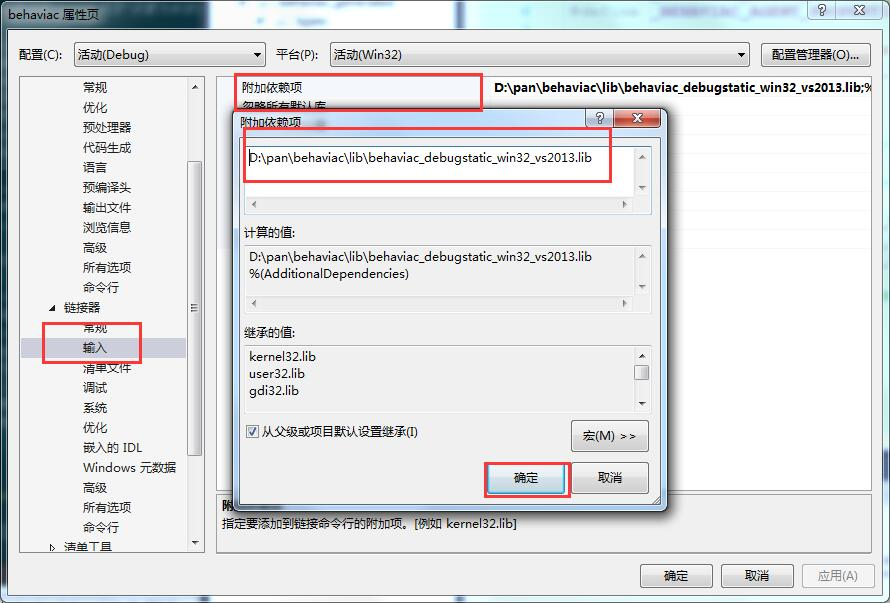
3. 将编辑器生成的Agent子类的类型和相关的“胶水”代码都整合到自己的项目中
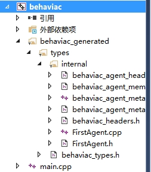
4. 代码内容
	1. 首先，在InitBehaviac()方法中初始化behaviac的加载目录和文件格式等
	```cpp
	bool InitBehaviac()
	{
		cout << "InitBehavic" << endl;

		behaviac::Workspace::GetInstance()->SetFilePath("D:/pan/test_behaviac/exported");
		behaviac::Workspace::GetInstance()->SetFileFormat(behaviac::Workspace::EFF_xml);

		return true;
	}
	```
	上面的几个接口说明如下：
		- Workspace::SetFilePath()用于设置加载编辑器导出的行为树所在的目录。
		- Workspace::SetFileFormat()用于设置加载的行为树格式，这里用的是xml格式。
	2. 接着，创建Agent子类“FirstAgent”的实例，并加载指定的行为树，这里的行为树名字为“FirstBT”
	```cpp
	bool InitPlayer()
	{
		cout << "InitPlayer" << endl;

		g_FirstAgent = behaviac::Agent::Create<FirstAgent>();
		bool bRet = g_FirstAgent->btload("FirstBT");
		g_FirstAgent->btsetcurrent("FirstBT");

		return bRet;
	}
	```
	上面的几个接口说明如下：
		- Agent::Create()用于创建Agent子类的实例。
		- Agent::btload()用于加载行为树，入口参数是行为树的名字，不要加后缀。
		- Agent::btsetcurrent()用于指定当前准备执行的行为树。
	3. 其次，开始执行行为树
	```cpp
	void UpdateLoop()
	{
		cout << "UpdateLoop" << endl;

		int frames = 0;
		behaviac::EBTStatus status = behaviac::BT_RUNNING;

		while (status == behaviac::BT_RUNNING)
		{
			status = g_FirstAgent->btexec();
		}
	}
	```
	另外，如果不通过Agent::btexec()来单独执行行为树，也可以调用Workspace::Update()的方式来统一执行所有Agent实例的行为树
		- Agent::btexec()用于执行一次前面通过Agent::btsetcurrent()指定的行为树
	4. 然后，对创建的Agent实例进行销毁释放，并清理整个工作区
	```cpp
	void CleanupPlayer()
	{
		cout << "CleanupPlayer" << endl;

		behaviac::Agent::Destroy(g_FirstAgent);
	}
	
	void CleanupBehavic()
	{
		cout << "CleanupBehavic" << endl;
		behaviac::Workspace::GetInstance()->Cleanup();
	}
	```
	5. 最后，打开FirstAgent.cpp文件，并修改FirstAgent::SayHello()方法
	```cpp
	void FirstAgent::SayHello()
	{
	///<<< BEGIN WRITING YOUR CODE SayHello
		printf("\nHello Behaviac!\n\n");
	///<<< END WRITING YOUR CODE
	}
	```
	注意：自己的代码需要添加在“///<<< BEGIN WRITING YOUR CODE”和“///<<< END WRITING YOUR CODE”之间，以便编辑器下次生成代码的时候，可以自动合并手工添加的内容和生成的内容。
5. 编译执行
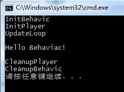
可以看到，程序结果输出了“Hello Behaviac!”，也就是成功执行了我们创建的第一棵最简单的行为树，并成功执行了动作节点配置的成员方法“SayHello”
6. 完整代码
	- main.cpp
	```cpp
	#include <iostream>
	#include "behaviac_generated/types/behaviac_types.h"

	using std::cout;
	using std::endl;

	FirstAgent* g_FirstAgent;

	bool InitBehaviac()
	{
		cout << "InitBehavic" << endl;

		behaviac::Workspace::GetInstance()->SetFilePath("D:/pan/test_behaviac/exported");
		behaviac::Workspace::GetInstance()->SetFileFormat(behaviac::Workspace::EFF_xml);

		return true;
	}

	bool InitPlayer()
	{
		cout << "InitPlayer" << endl;

		g_FirstAgent = behaviac::Agent::Create<FirstAgent>();
		bool bRet = g_FirstAgent->btload("FirstBT");
		g_FirstAgent->btsetcurrent("FirstBT");

		return bRet;
	}

	void UpdateLoop()
	{
		cout << "UpdateLoop" << endl;

		int frames = 0;
		behaviac::EBTStatus status = behaviac::BT_RUNNING;

		while (status == behaviac::BT_RUNNING)
		{
			status = g_FirstAgent->btexec();
		}
	}

	void CleanupPlayer()
	{
		cout << "CleanupPlayer" << endl;

		behaviac::Agent::Destroy(g_FirstAgent);
	}

	void CleanupBehavic()
	{
		cout << "CleanupBehavic" << endl;
		behaviac::Workspace::GetInstance()->Cleanup();
	}

	int main(int argc, char** argv)
	{
		InitBehaviac();
		InitPlayer();
		UpdateLoop();
		CleanupPlayer();
		CleanupBehavic();

		return 0;
	}

	```

## 行为树中包含实例
- ==使用实例前一定要保证数据初始化过了==
```cpp
bool InitPlayer()
{
	cout << "InitPlayer" << endl;

	g_pFirstAgent = behaviac::Agent::Create<FirstAgent>();
	bool bRet = g_pFirstAgent->btload("InstanceBT");
	g_pFirstAgent->btsetcurrent("InstanceBT");

	g_pSecondAgent = behaviac::Agent::Create<SecondAgent>();
	g_pFirstAgent->SetSecondAgent(g_pSecondAgent);

	g_pThirdAgent = behaviac::Agent::Create<SecondAgent>("SecondAgentInstance");

	return bRet;
}
```
- ==结束时一定要按照初始化反序销毁==
```cpp
void CleanupPlayer()
{
	cout << "CleanupPlayer" << endl;

	behaviac::Agent::Destroy(g_pThirdAgent);
	behaviac::Agent::Destroy(g_pSecondAgent);
	behaviac::Agent::Destroy(g_pFirstAgent);
}
```

## 预制(prefab)
- 用法
	- 可以方便的创建prefab的多个实例，减少操作
	- 修改基类prefab的时候，所有子prefab会同时变化，减少修改量
	- prefab的实例可以做特殊的修改，同时不会影响积累的prefab，而且当基类prefab做修改时，实例已经做修改的部分将不会改变
- 创建
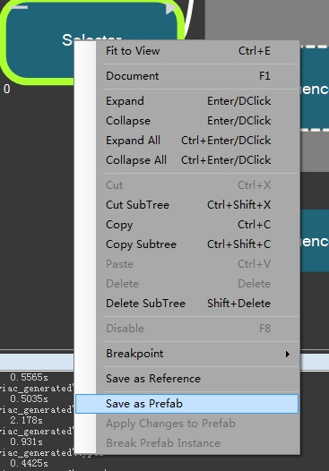
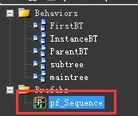
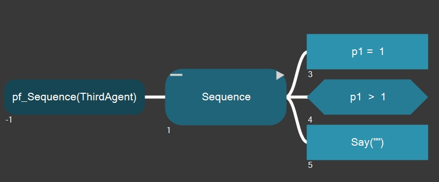
- 使用
直接拖过来就能用了
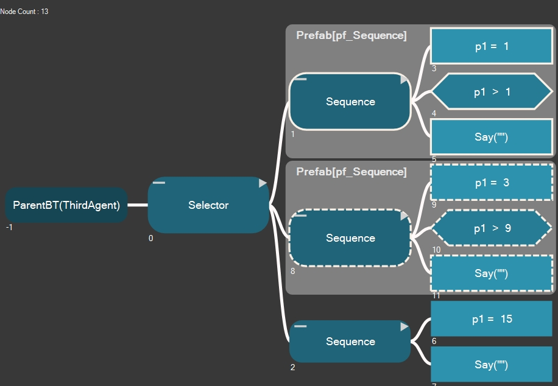

## 子树

### 普通子树
- 用法
	- 和prefab基本一样，但是修改子树一定会影响所有用到子树的地方，没有定制子树的功能
- 创建(就是普通的行为树)
先创建普通的树
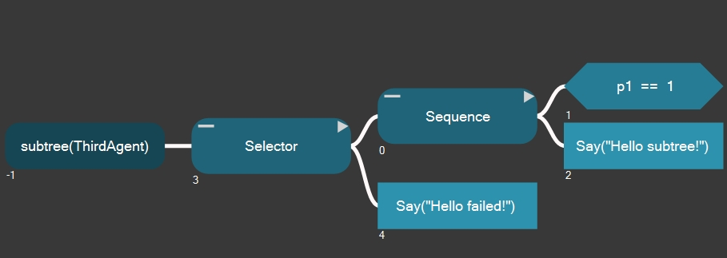
- 使用
将子树直接拖到需要使用的树上即可
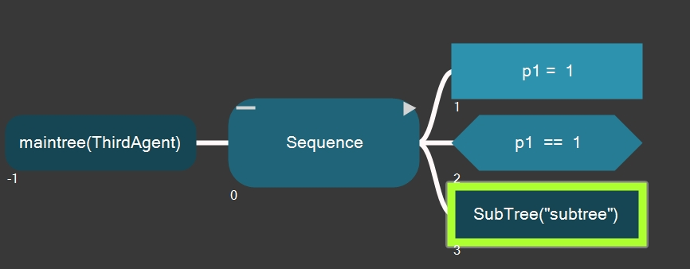
也可以从组件中拖动空间subtree到目标位置，然后配置属性
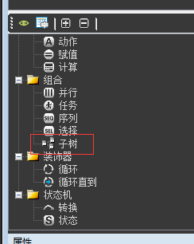
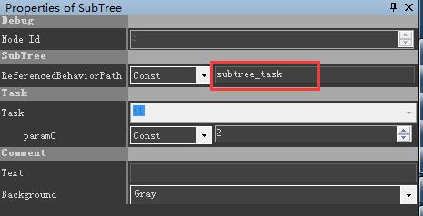

### 有参数的子树
- 用法
	- 有参数的子树就相当于一个函数一样
- 创建
第一个子节点必须是任务节点
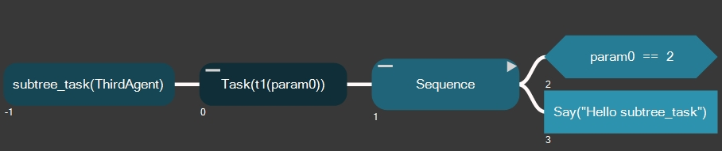
- 任务节点的参数创建
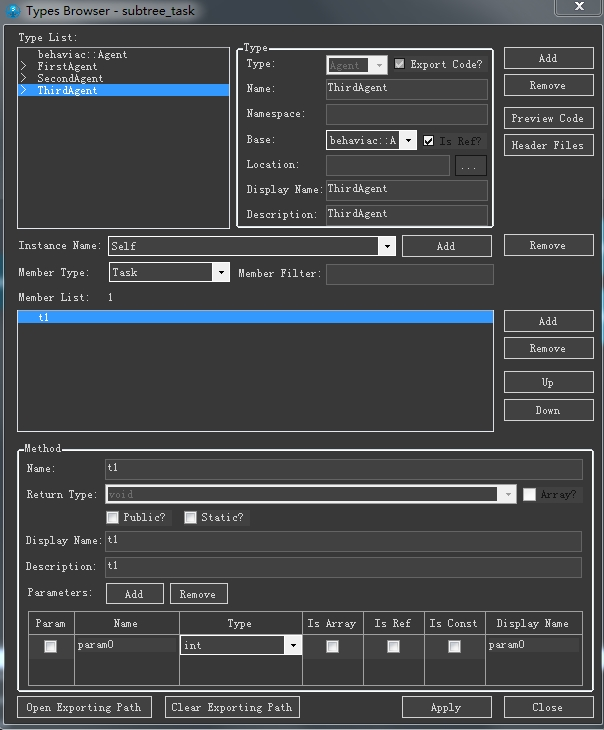
- 任务节点的使用
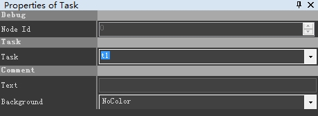
- 创建使用子树的树
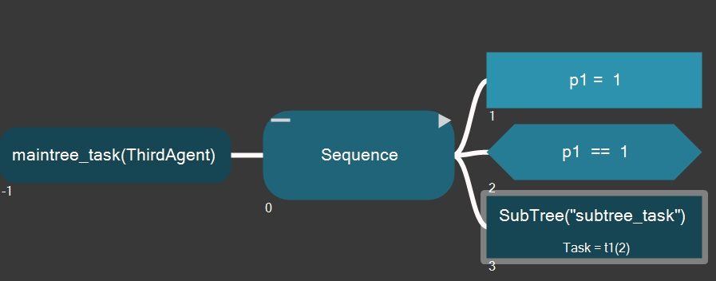
- 设置使用子树的参数
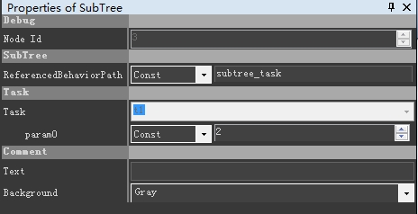

## 事件的使用
可以通过触发事件的方式调用
- 在agent中增加事件
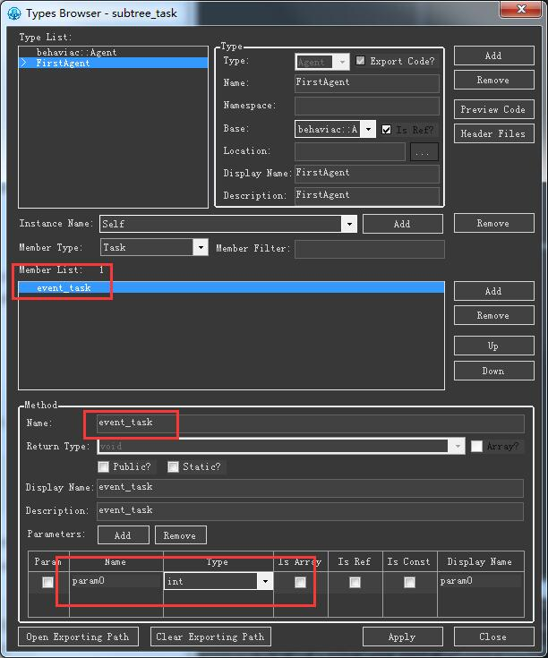
- 创建事件监听子树
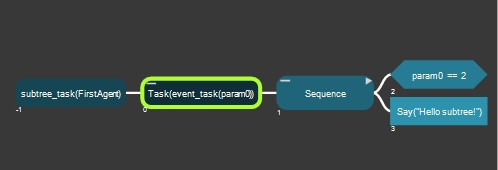
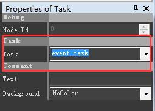
- 创建事件监听树
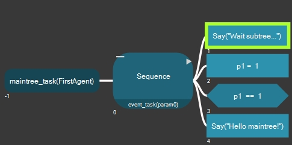
==状态必须是running，否则不会监听事件==
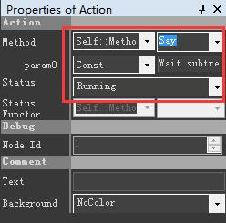
- 给主树添加事件监听
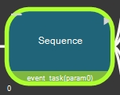
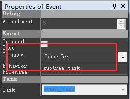
其中trigger有两种类型
	- transfer	转移	操作状态从主树移动到子树，并且在子树执行完成后，不会继续执行主树的后续内容
	- return	返回	子树执行完成后，会返回主树，由主树继续执行
- 代码中调用/触发事件
事件只会触发在running状态的action,在running状态中,如果事件没有被触发,会一直重复循环调用running状态的action
```cpp
void UpdateLoop()
{
	cout << "UpdateLoop" << endl;

	behaviac::EBTStatus status = g_pFirstAgent->btexec();
	g_pFirstAgent->FireEvent("event_task", 2);
}
```

## 调试
可以详细了解行为树的运行流程、状态，同时可以动态的修改参数变量的值进行测试
- 为FirstAgent增加方法
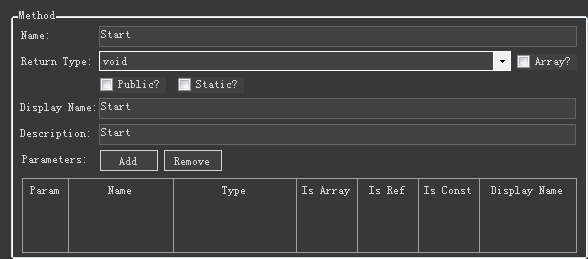
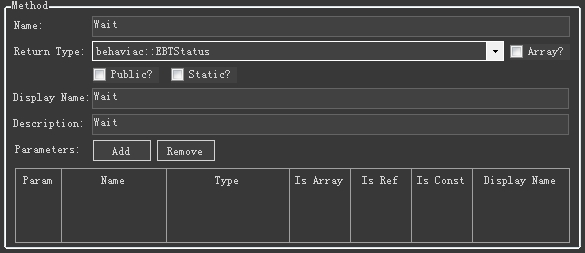
- 创建测试行为树
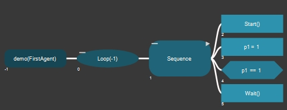
- 关键代码
等待调试工具连接后运行`behaviac::Config::SetSocketBlocking(true);`
设置监听端口`behaviac::Config::SetSocketPort(9999);`
为了在连调时，程序端能够发送消息到编辑器端，需要在游戏循环中执行`behaviac::Workspace::GetInstance()->DebugUpdate();`
```cpp
	bool InitBehaviac()
	{
		cout << "InitBehaviac" << endl;

		behaviac::Config::SetSocketBlocking(true);
		//behaviac::Config::SetSocketPort(9999);

		behaviac::Workspace::GetInstance()->SetFilePath(xmlPath);
		behaviac::Workspace::GetInstance()->SetFileFormat(behaviac::Workspace::EFF_xml);

		return true;
	}

	void UpdateLoop()
	{
		cout << "UpdateLoop" << endl;

		int frame = 0;
		behaviac::EBTStatus status = behaviac::BT_RUNNING;

		while (status == behaviac::BT_RUNNING)
		{
			++frame;
			cout << "frame " << frame << endl;

			behaviac::Workspace::GetInstance()->DebugUpdate();

			status = g_pFirstAgent->btexec();
		}
	}
```
- 运行程序`Ctrl`+`F5`
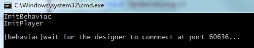
- 编辑器连接程序
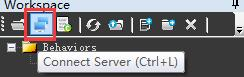

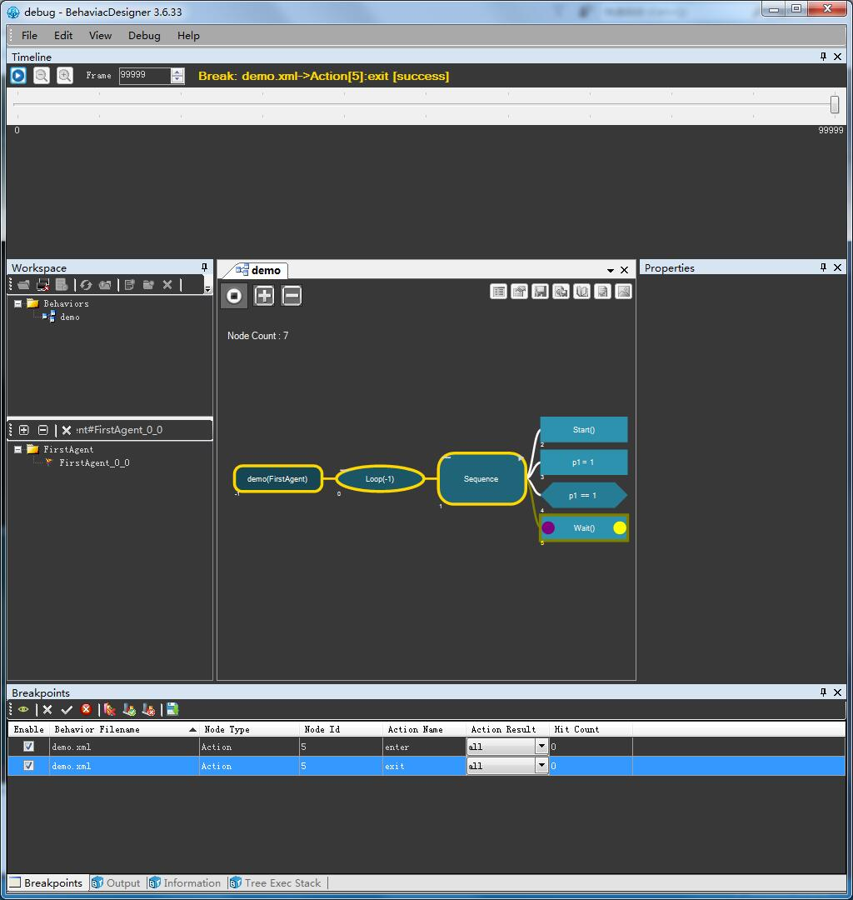
	- 双击节点左方添加/取消勾选/删除进入函数前断点
	- 双击节点右方添加/取消勾选/删除退出函数前断点
	- 双击对象树名可以查看对应的变量属性
	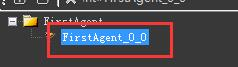
	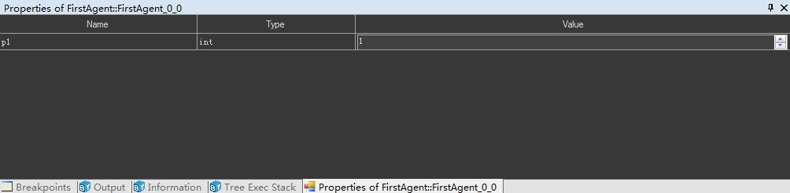
	- `F5`可以继续执行
	- 断开连接
	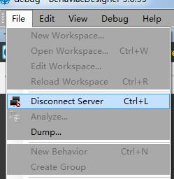

## 结构体
- 创建结构体

- 使用结构体
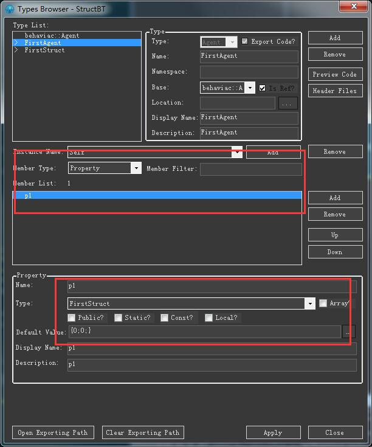
- 创建行为树
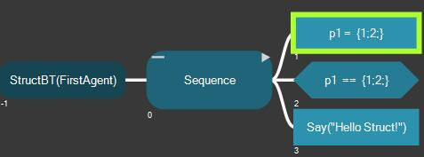
- 使用
像正常参数一样使用即可

## 枚举
- 注
无需特意设置枚举的值，编辑器里面的`-1`和没有设置是一样的，按照语法规则就是从0开始，向下递增的
- 创建

- 使用

- 创建行为树

- 设置节点属性

- 代码
和普通的代码一致

## 定制自己的文件加载方法

### 需求探索
有的时候，由于自身项目的需要，例如对行为树文件进行加密、打包等处理，behaviac组件默认提供的文件加载机制不再满足需要，因此程序端需要定制自己的读取方式来加载行为树文件。

### 方法
1. 需要从behaviac::CFileManager派生出自己的子类，并根据需要重载相关的方法，如下代码所示：
	```cpp
	#include "behaviac/common/file/filemanager.h"

	class BEHAVIAC_API MyFileManager : public behaviac::CFileManager
	{
	public:
		BEHAVIAC_DECLARE_MEMORY_OPERATORS(MyFileManager);

		MyFileManager();
		virtual ~MyFileManager();

		virtual behaviac::IFile* FileOpen(const char* fileName, behaviac::CFileSystem::EOpenMode iOpenAccess = behaviac::CFileSystem::EOpenMode_Read);

		virtual void FileClose(behaviac::IFile* file);
		virtual bool FileExists(const char* fileName);
		virtual bool FileExists(const behaviac::string& filePath, const behaviac::string& ext);

		virtual uint64_t FileGetSize(const char* fileName);
		virtual behaviac::wstring GetCurrentWorkingDirectory();
	};
	```
2. 根据自己的开发平台需要，实现相应的方法，这里只是简单的调用了基类的同名方法，仅用于演示流程，如下代码所示：
	```cpp
	#include "myfilemanager.h"

	MyFileManager::MyFileManager()
	{
	}

	MyFileManager::~MyFileManager()
	{
	}

	behaviac::IFile* MyFileManager::FileOpen(const char* fileName, behaviac::CFileSystem::EOpenMode iOpenAccess)
	{
		// 需要实现自己的代码，这里直接调用基类的方法仅供演示
		return CFileManager::FileOpen(fileName, iOpenAccess);
	}

	void MyFileManager::FileClose(behaviac::IFile* file)
	{
		CFileManager::FileClose(file);
	}

	bool MyFileManager::FileExists(const behaviac::string& filePath, const behaviac::string& ext)
	{
		return CFileManager::FileExists(filePath, ext);
	}

	bool MyFileManager::FileExists(const char* fileName)
	{
		return CFileManager::FileExists(fileName);
	}

	uint64_t MyFileManager::FileGetSize(const char* fileName)
	{
		return CFileManager::FileGetSize(fileName);
	}

	behaviac::wstring MyFileManager::GetCurrentWorkingDirectory()
	{
		return CFileManager::GetCurrentWorkingDirectory();
	}
	```
3. 在程序端初始化的地方，创建MyFileManager实例，如下代码所示：
	```cpp
	bool InitBehavic()
	{
		LOGI("InitBehavic\n");

		g_MyFileManager = BEHAVIAC_NEW MyFileManager();

		behaviac::Workspace::GetInstance()->SetFilePath("../tutorials/tutorial_10/cpp/exported");

		behaviac::Workspace::GetInstance()->SetFileFormat(behaviac::Workspace::EFF_xml);

		return true;
	}
	```
4. 调用Agent::btload()方法，就可以通过上面实现的MyFileManager来加载行为树文件了（Agent::btload()方法内部会执行到MyFileManager::FileOpen()方法），如下代码所示：
	```cpp
	bool InitPlayer()
	{
		LOGI("InitPlayer\n");

		g_FirstAgent = behaviac::Agent::Create<FirstAgent>();

		bool bRet = g_FirstAgent->btload("FirstBT");

		g_FirstAgent->btsetcurrent("FirstBT");

		return bRet;
	}
	```
5. 在程序端结束清理的地方，销毁上面创建的MyFileManager实例，如下代码所示：
	```cpp
	void CleanupBehaviac()
	{
		LOGI("CleanupBehaviac\n");

		behaviac::Workspace::GetInstance()->Cleanup();

		if (g_MyFileManager)
		{
			BEHAVIAC_DELETE(g_MyFileManager);
			g_MyFileManager = NULL;
		}
	}
	```
## 并行节点(Parallel)

### 属性说明

- **失败条件：**FAIL_ON_ONE表示一个子节点返回失败，那么并行节点就返回失败。
- **成功条件：**SUCCEED_ON_ALL表示所有子节点都返回成功，并行节点才返回成功。这里需要注意，失败条件优先于成功条件。
- **子节点结束继续条件：**CHILDFINISH_LOOP表示子节点结束后会重新再循环执行。
- **退出行为：**EXIT_ABORT_RUNNINGSIBLINGS表示当并行节点的成功或失败条件满足并返回成功或失败后，会终止掉其他还在运行的子节点。

### 使用说明

- 创建FirstAgent的属性

- 创建FirstAgent的方法

- 创建使用parallel的行为树

- parallel节点的属性

- 关键代码
	```cpp
	behaviac::EBTStatus FirstAgent::Say(behaviac::string& value, bool isLatent)
	{
	///<<< BEGIN WRITING YOUR CODE Say
		if (isLatent && behaviac::Workspace::GetInstance()->GetFrameSinceStartup() < 3)
		{
			printf("\n%s [Running]\n\n", value.c_str());
			return behaviac::BT_RUNNING;
		}
		printf("\n%s [Success]\n\n", value.c_str());
		return behaviac::BT_SUCCESS;
	///<<< END WRITING YOUR CODE
	}
	```
- 运行结果

- 另外
当parallel节点属性为

时，运行结果为：


## 三种自带随机功能的Compasite

==注：为防止每次随机内容相同，需要手动设置随机种子==
```cpp
time_t timer;
time(&timer);
behaviac::RandomGenerator::GetInstance()->setSeed((unsigned int)timer);
```

### SecquenceStochastic
按随机顺序执行节点


### SelectorStochastic


### SelectorProbability


## 关于运行状态的解释
聪明的读者可能会问，上面的例子中只讲了成功或失败的情况，但如果动作要持续一段时间呢？如果5号节点，Fire需要持续一段时间呢？

节点的执行结果可以是“成功”，“失败”，或“运行”。
对于持续运行一段时间的Fire动作，其执行结果持续返回“运行”，结束的时候返回“成功”。
对于持续运行一段时间的Wait动作，其执行结果持续返回“运行”，当等待时间到达的时候返回“成功”。
当节点持续返回“运行”的时候，BT树的内部“知道”该节点是在持续“运行”的，从而在后续的执行过程中“直接”继续执行该节点，而不需要从头开始执行，直到该运行状态的节点返回“成功”或“失败”，从而继续后续的节点。从外面看，就像“阻塞”在了那个“运行”的节点上，其父节点就像不再管理，要一直等运行的子节点结束的时候，其父节点才再次接管

（请注意，这一段说明只是从概念上这样讲，概念上可以这样理解，实际上即使运行状态的节点每次执行也是要返回的，只是其返回值是运行，其父节点对于返回值是运行状态的节点，将使其继续，所以看上去好像父节点不再管理。）。

### 另一个例子

如上图，为了清晰说明运行状态，来看另一个例子。在这个例子中，Condition，Action1，Action3是3个函数。

- 0号节点是个Loop节点，循环3次。
- 1号节点是个Sequence节点
- 2号节点模拟一个条件，直接返回成功。
- 3号节点Action1是一个动作，直接返回成功。
- 4号节点Action3同样是一个动作，返回3次运行，然后返回成功。

其代码如下：
```cpp
bool CBTPlayer::Condition()
{
    m_Frames = 0;
    cout << "\tCondition\n";
    return true;
}
behaviac::EBTStatus CBTPlayer::Action1()
{
    cout << "\tAction1\n";
    return behaviac::BT_SUCCESS;
}
behaviac::EBTStatus CBTPlayer::Action3()
{
    cout << "\tAction3\n";
    m_Frames++;
    if (m_Frames == 3)
    {
        return behaviac::BT_SUCCESS;
    }
    return behaviac::BT_RUNNING;
}
```

而执行该BT树的C++代码如下：
```cpp
int frames = 0;
behaviac::EBTStatus status = behaviac::BT_RUNNING;
while (status == behaviac::BT_RUNNING)
{
	cout << \" frame " << ++frames << std::endl;
	status = g_player->btexec();

	//other codes
}
```

上面的执行行为树的代码就如同游戏更新部分。status = g_player->btexec()是在游戏的更新函数（update或tick）里，需要每帧调用。
特别的，对于运行状态，即使运行状态概念上讲是“阻塞”在节点，但是依然是每帧需要调用btexec，也就是说，其节点依然是每帧都在运行，只是下一帧是继续上一帧，从而表现的是运行状态，在其结束之前，其父节点不会把控制转移给其他后续节点。这里的“阻塞”并非真的被阻塞，并非后续的代码(上面的other codes部分)不会被执行。status = g_player->btexec()后面如果有代码，依然被执行。

执行结果会是个什么样的输出呢？


第1帧：
2号节点Condition返回“成功”，继续执行3号Action1节点，同样返回“成功”，接续执行4号Action3，返回“运行”。

第2帧：
由于上一帧4号Action3返回“运行”，直接继续执行4号Action3节点。

第3帧：
由于上一帧4号Action3返回“运行”，直接继续执行4号Action3节点。

同样需要注意的是，2号Condition节点不再被执行。

而且，本次Action3返回“成功”，1号Sequence节点返回成功。0号Loop节点结束第1次迭代。
第4帧：
Loop的第2次迭代开始，就像第1帧的执行。


### 再进阶
又有聪明的读者要问了，持续返回“运行”状态的节点固然优化了执行，但其结果就像“阻塞”了BT的执行一样，如果发生了其他“重要”的事情需要处理怎么办？

在behaviac里至少有多种办法。
#### 使用前置

每个节点都可以添加前置附件或后置附件。
上图的action节点添加了一个前置，两个后置。

可以添加前置附件，并且“执行时机”设为Update或Both，则在每次执行之前都会先执行前置里配置的条件。
#### 使用==Parallel==节点

如上图，可以使用Parallel节点来“一边检查条件，一边执行动作”，该条件作为该动作的“Guard”条件。当该条件失败的时候来结束该处于持续运行状态的动作节点。

#### 使用==SelectorMonitor==节点

- SelectorMonitor是一个动态的选择节点，和Selector相同的是，它选择第一个success的节点，但不同的是，它不是只选择一次，而是每次执行的时候都对其子节点进行选择。如上图所示，假若它选择了下面有True条件的那个节点（节点7）并且下面的1号Sequence节点在运行状态，下一次它执行的时候，它依然会去检查上面的那个8号条件的子树，如果该条件为真，则终止下面的运行节点而执行9号节点。
- WithPrecondition有precondition子树和action子树。只有precondition子树返回success的时候，action子树才能够被执行。

#### 使用Event子树
任何一个BT都可以作为事件子树，作为event附加到任何的一个节点上(用鼠标拖动BT到节点)。当运行该BT的时候，如果发生了某个事件，可以通过Agent::FireEvent来触发该事件，则处于running状态的节点，从下到上都有机会检查是否需要响应该事件，如果有该事件配置，则相应的事件子树就会被触发。请参考behaviac的相关文档获取详细信息。

### 总结
行为树的基本概念：
- 执行每个节点都会有一个结果（成功，失败或运行）
- 子节点的执行结果由其父节点控制和管理
- 返回运行结果的节点被视作处于运行状态，处于运行状态的节点将被持续执行一直到其返回结束（成功或失败）。在其结束前，其父节点不会把控制转移到后续节点。

其中理解运行状态是理解行为树的关键，也是使用好行为树的关键。

## 日志/Profile
开启:初始化behaviac最前面增加`behaviac::Config::SetLogging(true);`
开启profile输出:开启日志输出的同时,增加`behaviac::Config::SetProfiling(true);`

时间单位，在支持`QueryPerformanceCounter`和`QueryPerformanceFrequency`的情况下是microsecond
在不支持上述计时的情况下,是millisecond*1000的值(精度不够的微秒)

日志会显示所有节点的执行过程和执行时间
日志内容:
```text
[18:21:51][workspace] xml ""
[18:21:51][jump]TestAgent#TestAgent_0_0 test.xml
[18:21:51][tick]TestAgent#TestAgent_0_0 test.xml->BehaviorTree[-1]:enter [success] [1]
[18:21:51][tick]TestAgent#TestAgent_0_0 test.xml->Selector[6]:enter [success] [1]
[18:21:51][tick]TestAgent#TestAgent_0_0 test.xml->Sequence[1]:enter [success] [1]
[18:21:51][tick]TestAgent#TestAgent_0_0 test.xml->Action[7]:enter [success] [1]
[18:21:51][tick]TestAgent#TestAgent_0_0 test.xml->Action[7]:exit [failure] [1]
[18:21:51][profiler]test.xml->Action[7] 373
[18:21:51][tick]TestAgent#TestAgent_0_0 test.xml->Sequence[1]:exit [failure] [1]
[18:21:51][profiler]test.xml->Sequence[1] 657
[18:21:51][tick]TestAgent#TestAgent_0_0 test.xml->Sequence[2]:enter [success] [1]
[18:21:51][tick]TestAgent#TestAgent_0_0 test.xml->Condition[0]:enter [success] [1]
[18:21:51][tick]TestAgent#TestAgent_0_0 test.xml->Condition[0]:exit [success] [1]
[18:21:51][profiler]test.xml->Condition[0] 311
[18:21:51][tick]TestAgent#TestAgent_0_0 test.xml->Action[11]:enter [success] [1]
[18:21:51][profiler]test.xml->Action[11] 268
[18:21:51][profiler]test.xml->Sequence[2] 842
[18:21:51][profiler]test.xml->Selector[6] 1734
[18:21:51][profiler]test.xml->BehaviorTree[-1] 1988
[18:21:51][property]TestAgent#TestAgent_0_0 m_count->1
[18:21:51][profiler]test.xml->Action[11] 209
[18:21:51][profiler]test.xml->BehaviorTree[-1] 329
[18:21:51][property]TestAgent#TestAgent_0_0 m_count->2
[18:21:51][profiler]test.xml->Action[11] 75
[18:21:51][profiler]test.xml->BehaviorTree[-1] 158
[18:21:51][property]TestAgent#TestAgent_0_0 m_count->3
[18:21:51][profiler]test.xml->Action[11] 62
[18:21:51][profiler]test.xml->BehaviorTree[-1] 153
[18:21:51][property]TestAgent#TestAgent_0_0 m_count->4
[18:21:51][profiler]test.xml->Action[11] 60
[18:21:51][profiler]test.xml->BehaviorTree[-1] 132
[18:21:51][property]TestAgent#TestAgent_0_0 m_count->5
[18:21:51][profiler]test.xml->Action[11] 100
[18:21:51][profiler]test.xml->BehaviorTree[-1] 165
[18:21:51][property]TestAgent#TestAgent_0_0 m_count->6
[18:21:51][profiler]test.xml->Action[11] 62
[18:21:51][profiler]test.xml->BehaviorTree[-1] 133
[18:21:51][property]TestAgent#TestAgent_0_0 m_count->7
[18:21:51][profiler]test.xml->Action[11] 115
[18:21:51][profiler]test.xml->BehaviorTree[-1] 191
[18:21:51][property]TestAgent#TestAgent_0_0 m_count->8
[18:21:51][profiler]test.xml->Action[11] 61
[18:21:51][profiler]test.xml->BehaviorTree[-1] 130
[18:21:51][property]TestAgent#TestAgent_0_0 m_count->9
[18:21:51][tick]TestAgent#TestAgent_0_0 test.xml->Action[11]:exit [failure] [1]
[18:21:51][tick]TestAgent#TestAgent_0_0 test.xml->Sequence[2]:exit [failure] [1]
[18:21:51][tick]TestAgent#TestAgent_0_0 test.xml->Selector[6]:exit [failure] [1]
[18:21:51][return]TestAgent#TestAgent_0_0 test.xml
[18:21:51][tick]TestAgent#TestAgent_0_0 test.xml->BehaviorTree[-1]:exit [failure] [1]
[18:21:51][jump]TestAgent#TestAgent_0_0 task.xml
[18:21:51][tick]TestAgent#TestAgent_0_0 task.xml->BehaviorTree[-1]:enter [success] [1]
[18:21:51][tick]TestAgent#TestAgent_0_0 task.xml->Task[0]:enter [success] [1]
[18:21:51][tick]TestAgent#TestAgent_0_0 task.xml->Action[1]:enter [success] [1]
[18:21:51][tick]TestAgent#TestAgent_0_0 task.xml->Action[1]:exit [success] [1]
[18:21:51][profiler]task.xml->Action[1] 403
[18:21:51][tick]TestAgent#TestAgent_0_0 task.xml->Task[0]:exit [success] [1]
[18:21:51][profiler]task.xml->Task[0] 637
[18:21:51][return]TestAgent#TestAgent_0_0 task.xml
[18:21:51][tick]TestAgent#TestAgent_0_0 task.xml->BehaviorTree[-1]:exit [success] [1]
[18:21:51][profiler]task.xml->BehaviorTree[-1] 943

```

## 目录文件分析


test	workspace名称
>test.workspace.xml	记录着项目文件/输出文件的存储目录
>behaviors	编辑器保存编辑内容的目录
>>task.xml	task行为树的所有节点和节点之间的关系
>>test.xml	task行为树的所有节点和节点之间的关系
>>behaviac_meta	记录当前workspace的所有数据类型的文件夹
>>>test.meta.xml	记录当前workspace的所有数据类型
>exported	所有导出文件夹
>>task.xml	导出给程序用的task树解析文件
>>test.xml	导出给程序用的test树解析文件
>>meta	记录当前workspace的所有数据类型和他们的属性的文件夹
>>>test.meta.xml	记录当前workspace的所有数据类型和他们的属性的文件


导入到cpp项目中的文件

>types
>>behaviac_types.h	使用行为树需要包含的唯一头文件
>>internal
>>>TestAgent.h	使用的Agent子类型
>>>TestAgent.cpp

## 代码分析

### behaviac::Config
用于行为树全局的配置，包含日志，Profile，调试监听配置等设置
SetLogging
SetProfiling

### behaviac::Workspace
使用单例GetInstance
SetFilePath	设置需要解析的导出文件的目录
SetFileFormat	设置需要解析的文件格式
Cleanup	清除所有workspace信息

内部调用
RegisterBasicNodes	注册所有功能模块

属性
m_behaviortrees	记录所有行为树配置<行为树名,行为树对象实例指针>
m_allBehaviorTreeTasks	记录行为树所有的task<行为树名,{vector<BehaviorTreeTask*>,vector<Agent*>}>

### agent.h/agent.cpp

所有行为树对象的基类
主要方法
	- Create<T>	创建agent对象	静态方法
	- Destroy	销毁agent对象	静态方法
	- btload	加载某颗行为树
	- btsetcurrent	设置当前的执行节点
	- btexec	从当前节点开始执行
	- FireEvent	触发事件(参数:事件名称字符串(当前agent内的自定义事件名))

继承关系
>CRTTIBase
>>CTagObject
>>>Agent
>>>>自定义Agent

最重要函数
==btexec==

主要属性
m_behaviorTreeTasks	任务指针数组
m_currentBT	当前执行的任务

agent对象和用户自定义的agent对象是通过behaviac::Context::ms_contexts来进行管理的，所有的agent对象都是new出来的heap对象,
ms_contexts是context的map集合，默认的contextid是0

- Create调用可能的行为
	- 设置主线程id
	- 注册所有节点类型
	- 注册所有基本数据类型
	- 注册所有agent和其子类的属性、方法
	- 加载行为树编辑器生成的meta文件
	- new对应Create的T实例
	- 初始化创建的实例属性
	- 初始化对应的contextid的context
	- 将创建的实例放在对应的context中进行管理

- btload调用可能的行为
	- 所有可以进行运算的数据类型进行注册ms_valueComputers
	- Config::LogInfo的日志基本信息输出，通知是否显示某些功能的日志
	- BaseStart的调用，就是Create的注册行为的调用
	- 开启热更新守护线程，通过IOCP/EPOLL来进行文件变更监视，在Workspace::Update()调用中会更新所有有变动的行为树配置

### behaviortree_task.h/behaviortree_task.cpp

==行为树的任务==

#### 描述
所有的task都包含exec接口，用于执行任务，返回任务的运行状态(成功/失败/运行)

#### 相关函数:
>BehaviorTask::exec
>>onenter_action
>>onexit_action
>>update_current
>>>update

#### 相关属性
const BehaviorNode* 	m_node;	// 包含这个task的节点node


#### 继承关系(部分)
>CRTTIBase
>>BehaviorTask
>>>BranchTask

>>>>CompositeTask
>>>>>CompositeStochasticTask
>>>>>IfElseTask
>>>>>ParallelTask
>>>>>SelectorTask
>>>>>SelectorLoopTask
>>>>>SelectorProbabilityTask
>>>>>SequenceTask

>>>>SingeChildTask
>>>>>BehaviorTreeTask
>>>>>WaitforSignalTask
>>>>>ReferencedBehaviorTask
>>>>>DecoratorTask

>>>AttachmentTask
>>>>EventetTask

>>>LeafTask
>>>>ActionTask
>>>>AssignmentTask
>>>>ComputeTask
>>>>NoopTask
>>>>WaitTask
>>>>WaitFramesTask
>>>>ConditionBaseTask

最重要函数
==exec==


### behaviortree.h/behaviortree.cpp

==行为树节点==

#### 描述
节点信息，包含节点的类型、所有相邻的下一层子节点、节点对应的任务信息

#### 相关属性
typedef behaviac::vector<BehaviorNode*> Nodes;
Nodes*				m_children;	// 子节点列表

#### 继承关系(部分)
>BehaviorNode

>>Action
>>AttachAction
>>Parallel
>>Selector
>>Sequence

>>ConditionBase
>>>Event
>>>And
>>>Condition

>>BehaviorTree

### sequence.h/sequence.cpp
**队列**

#### 继承关系
>CRTTIBase
>>BehaviorNode
>>>Sequence

#### 说明
本身是一个node，内部包含一个vector来组装左右的children(BehaviorTask)
children是通过BehaviorNode::AddChild来增加的
BehaviorNode::load时会调用AddChild
增加child流程
>Agent::btload
>>Workspace::Load
>>>BehaviorTree::load_xml
>>>>BehaviorNode::load_properties_pars_attachments_children
>>>>>BehaviorNode::AddChild

#### 调用流程
>Agent::btexec
>>Agent::btexec_
>>>BehaviorTask::exec
>>>>BranchTask::update_current
>>>>>SequenceTask::update
>>>>>>Sequence::SequenceUpdate

#### 返回值
Sequence::SequenceUpdate接口内部通过遍历所有的childtask,
顺序调用childtask的exec方法来获取每个任务的返回值,
根据这些返回值来提供接口最终的返回值


### selector.h/selector.cpp

同sequence.h/sequence.cpp一样
关键接口:
Selector::SelectorUpdate
不同的是循环判断的EBTState返回条件的结果不同

### parallel.h/parallel.cpp

同sequence.h/sequence.cpp一样
关键接口:
Parallel::ParallelUpdate
不同的是循环判断的EBTState返回条件的结果不同
==循环内没有return，所有child执行完成后，根据配置的返回条件来返回结果==

### condition.h/condition.cpp

条件接口
#### 关键函数:
`bool Evaluate(Agent* pAgent)`

#### 实现原理
通过比较操作符的枚举和重载操作符函数来实现的

### action.h/action.cpp
行为叶子节点
基类	BehaviorNode

调用流程
>Agent::btexec
>>Agent::btexec_
>>>BehaviorTask::exec
>>>>BehaviorTreeTask::update_current
>>>>>BranchTask::update_current
>>>>>>BehaviorTreeTask::update
>>>>>>>SingeChildTask::update
>>>>>>>>BehaviorTask::exec
>>>>>>>>>BehaviorTask::update_current
>>>>>>>>>>ActionTask::update
>>>>>>>>>>>Action::Execute
>>>>>>>>>>>>`CMethod_FirstAgent_Show::run`	自定义函数
>>>>>>>>>>>>>`FirstAgent::_Execute_Method_`	自定义函数
>>>>>>>>>>>>>>`FirstAgent::Show`	自定义函数

### AgentMeta
所有的静态数据管理类
数据解析，
将解析出的数据用map记录所有的函数

>Register	注册所有类型
>>RegisterBasicTypes	注册数据类型
>>LoadAllMetaFiles	加载所有元信息


## 自己总结
- node和task互相包含引用
	- node里面有对应的task指针
	- task里面有对应的node指针
- node的存储是`Workspace::BehaviorTrees_t m_behaviortrees;`
- task的存储是`AllBehaviorTreeTasks_t* m_allBehaviorTreeTasks;`也在workspace里面
- node根据它具体的子类型有不同的children,是从根节点一层一层延伸下去的
- task也根据他的具体子类型有不同的root/children,也是从根节点一层一层延伸下去的
- 对象的生成顺序
	- 配置文件生成
	- 程序加载配置文件
	- 程序设置当前要执行的树、节点
		- 同btload，所以说即使不掉用btload，也会在设置的时候加载相应树的内容到节点中
		- 找到设置的节点
		- 创建相关的所有节点的任务(CreateBehaviorTreeTask)
	- 执行
	- 销毁agent树对象
	- 销毁所有加载到内存中的对象

## 其他
以下内容没有完全理解充分
- 内存池的实现(这里用到内存池的地方只有一个PtrSizePool，实际上基本没有什么使用)
- 函数指针的使用
	- 编辑器程序先生成一个类，这个类代表一个自定义agent的一个方法
	- 根据方法名的crc32生成一个id，并把它注册到管理map里面，map的value是上面的类的实例
	- 使用的时候(load)将计算出id，从map中获取实例，用value->run(agent)的方法在内部调用agent->具体方法来实现函数的调用
- 模版的使用

## 需要注意的地方
- 类的继承关系，如果类的继承关系混乱了，函数的调用就会看不明白
- 数据具体存储的位置，node和task的管理和关系

