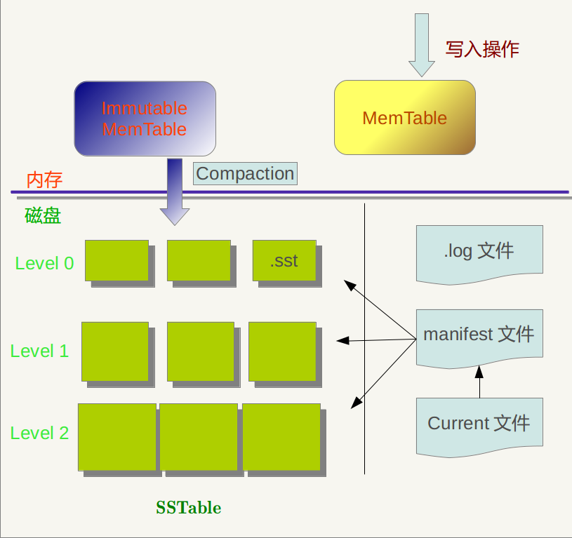
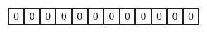
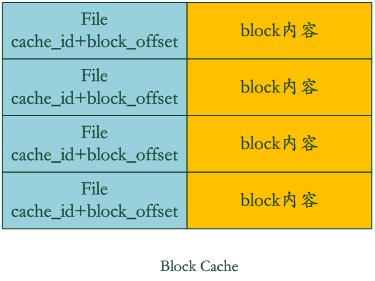
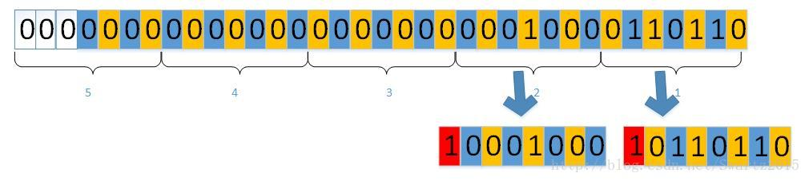

# RedisLV

[TOC]

## Redis

[新手教程地址](http://blog.csdn.net/wq343502916/article/details/47405977)

### 程序结构

./redis-benchmark //用于进行redis性能测试的工具
./redis-check-dump //用于修复出问题的dump.rdb文件
./redis-cli //redis的客户端
./redis-server //redis的服务端
./redis-check-aof //用于修复出问题的AOF文件
./redis-sentinel //用于集群管理

### 启动

`./redis-server ../redis.conf`
`redis.conf`为配置文件，可以修改端口

### 使用客户端

- 直接使用
  `./redis-cli`

- 修改端口后使用
  `./redis-cli -p 9903`

- 测试操作
  - 设置
     set pan "pa works"	// OK
  - 读取
     get pan	// "pa works"
  - 删除
     del pan	// (integer)1
  - 退出
     quit
  - 查看类型
     type pan
  - 可能报错
     (error) WRONGTYPE Operation against a key holding the wrong kind of value
     	就是操作数据用的命令错了，需要使用对应数据类型的命令来操作。
     	string可以使用get/set，但是hash需要使用hget/hset。

### 简介

redis是一种高级的key:value存储系统，其中value支持五种数据类型：
1. 字符串（strings）
2. 字符串列表（lists）
3. 字符串集合（sets）
4. 有序字符串集合（zset|sorted sets）
5. 哈希（hashes）

而关于key，有几个点要提醒大家：
1. key不要太长，尽量不要超过1024字节，这不仅消耗内存，而且会降低查找的效率；
2. key也不要太短，太短的话，key的可读性会降低；
3. 在一个项目中，key最好使用统一的命名模式，例如user:10000:passwd。

### 基本字符串操作

==命令不区分大小写==

```redis
> set pan "2"
OK
> type pan
string
> incr pan
(integer) 3
> get pan
"3"
> incrby pan 2
"5"
> decr pan
(inter) 4
> del pan
(integer) 1
```

- 设置和获取
```redis
SET server:name "fido"
GET server:name => "fido"
```
- 原子操作 递增
```redis
SET connections 10
INCR connections => 11
INCR connections => 12
DEL connections
INCR connections => 1
```
- 超时/过期时间设置
```redis
SET resource:lock "Redis Demo"
EXPIRE resource:lock 120
TTL resource:lock => 113
// after 113s
TTL resource:lock => -2
SET resource:lock "Redis Demo 1"
EXPIRE resource:lock 120
TTL resource:lock => 119
SET resource:lock "Redis Demo 2"
TTL resource:lock => -1
```
	- 时间单位`秒`(可以是`毫秒`:`pexpire`,`pttl`)
	- 超时后内容会被自动删除
	- 获取已超时的`ttl`会得到-2
	- 无超时信息的`ttl`值是-1
	- 设置已超时的变量的`ttl`值默认是-1

### lists

就是链表(不是数组)

#### 常用方法
- lpush
- rpush
- lrange

#### 例子
```redis
> lpush pan "1"
(integer) 1
> rpush pan "2"
(integer) 2
> lpush pan "0"
(integer) 3
> lrange pan 0 1
1) "0"
2) "1"
> lrange pan 0 -1
1) "0"
2) "1"
3) "2"
```

有序列表

- rpush 在list末尾增加值
```redis
RPUSH friends "Alice"
RPUSH friends "Bob"
```
- lpush 在list最前端插入值
```redis
LPUSH friends "Sam"
```
- lrange 获取list的值(像切片操作一样)(索引从0开始,-1是最后一个)
```redis
LRANGE friends 0 -1 => 1) "Sam", 2) "Alice", 3) "Bob"
LRANGE friends 0 1 => 1) "Sam", 2) "Alice"
LRANGE friends 1 2 => 1) "Alice", 2) "Bob"
```
- llen 获取list的长度
```redis
LLEN friends => 3
```
- lpop 删除list的第一个值并返回它
```redis
LPOP friends => "Sam"
```
- rpop 删除list的最后一个值并返回它
```redis
RPOP friends => "Bob"
```

上述操作后list最终值
```redis
LLEN friends => 1
LRANGE friends 0 -1 => 1) "Alice"
```

### 集合

set

```redis
>sadd pan "a"
(integer) 1
>sadd pan "b"
(integer) 1
> type pan
set
>smembers pan
1) "b"
2) "a"
```

像list一样,但是无序,元素只有一个不会重复出现

- sadd 添加元素
```redis
SADD superpowers "flight"
SADD superpowers "x-ray vision"
SADD superpowers "reflexes"
```
- srem 删除元素
```redis
SREM superpowers "reflexes"
```
- sismember 检测元素是否在set中
```redis
SISMEMBER superpowers "flight" => 1
SISMEMBER superpowers "reflexes" => 0
```
- smembers 返回set的所有元素
```redis
SMEMBERS superpowers => 1) "flight", 2) "x-ray vision"
```
- sunion 将1+个set合并在一起并返回(返回结果仍然是一个set,不会有重复元素(并集))
```redis
SADD birdpowers "pecking"
SADD birdpowers "flight"
SUNION superpowers birdpowers => 1) "pecking", 2) "x-ray vision", 3) "flight"
```

### 有序集合

sorted sets(zsets)

```redis
>zadd pan 1 "baidu"
(integer) 1
>zadd pan 2 "qq"
(integer) 1
>zadd pan 0 "taobao"
(integer) 1
>zrange pan 0 -1
1) taobao
2) baidu
3) qq
>zrange pan 0 -1 withscores
1) taobao
2) "0"
3) baidu
4) "1"
5) qq
6) "2"
```

和set相似,但每个元素都一个对应的`score`值用于排序

- zadd 添加元素
```redis
ZADD hackers 1940 "Alan Kay"
ZADD hackers 1906 "Grace Hopper"
ZADD hackers 1953 "Richard Stallman"
ZADD hackers 1965 "Yukihiro Matsumoto"
ZADD hackers 1916 "Claude Shannon"
ZADD hackers 1969 "Linus Torvalds"
ZADD hackers 1957 "Sophie Wilson"
ZADD hackers 1912 "Alan Turing"
```
- zrange 显示元素
```redis
ZRANGE hackers 0 -1
ZRANGE hackers 2 4 => 1) "Claude Shannon", 2) "Alan Kay", 3) "Richard Stallman"
```
- zrem 删除元素
```redis
zrem hackers "Alan Turing"
```

### 哈希

就是hashmap

```redis
> hmset pan name "pan" age 31
OK
> hgetall pan
1) "name"
2) "pan"
3) "age"
4) "31"
> hget pan name
"pan"
> hget pan age
"31"
> hset pan age 13
(integer) 0
> hget pan age
"13"
```

就是map,hash的key和value值都是string

- hset 添加元素
```redis
HSET user:1000 name "John Smith"
HSET user:1000 email "john.smith@example.com"
HSET user:1000 password "s3cret"
```
- hgetall 获取对象的全部属性
```redis
HGETALL user:1000
```
- hmset 同时设置一个对象的多条属性的对应值(Set multiple hash fields to multiple values)
```redis
HMSET user:1001 name "Mary Jones" password "hidden" email "mjones@example.com"
```
- hget 获取对象的特定属性
```redis
HGET user:1001 name => "Mary Jones"
```
- hincrby 原子性运算hash的value值(hash的数字处理都是按照字符串来处理的)
```redis
HSET user:1000 visits 10
HINCRBY user:1000 visits 1 => 11
HINCRBY user:1000 visits 10 => 21
HDEL user:1000 visits
HINCRBY user:1000 visits 1 => 1
```
- hdel 删除hash对象的指定属性

### redis持久化

两种方式
- RDB(Redis DataBase)
  就是在不同的时间点，将redis存储的数据生成快照并存储到磁盘等介质上
- AOF(Append Only File)
  是换了一个角度来实现持久化，那就是将redis执行过的所有写指令记录下来，在下次redis重新启动时，只要把这些写指令从前到后再重复执行一遍，就可以实现数据恢复了。

### 事物

1. `multi`组装
2. `exec`执行
3. `discard`取消
4. `watch`监视key，再key变化时取消执行

```redis
redis> MULTI //标记事务开始
OK
redis> INCR user_id //多条命令按顺序入队
QUEUED
redis> INCR user_id
QUEUED
redis> INCR user_id
QUEUED
redis> PING
QUEUED
redis> EXEC //执行
1) (integer) 1
2) (integer) 2
3) (integer) 3
4) PONG
```

- 调用exec之前的错误
  有可能是由于语法有误导致的，也可能时由于内存不足导致的。只要出现某个命令无法成功写入缓冲队列的情况，redis都会进行记录，在客户端调用EXEC时，redis会拒绝执行这一事务。
- 调用exec之后的错误
  redis则采取了完全不同的策略，即redis不会理睬这些错误，而是继续向下执行事务中的其他命令。这是因为，对于应用层面的错误，并不是redis自身需要考虑和处理的问题，所以一个事务中如果某一条命令执行失败，并不会影响接下来的其他命令的执行。

```watch
127.0.0.1:6379> set age 23
OK
127.0.0.1:6379> watch age //开始监视age
OK
127.0.0.1:6379> set age 24 //在EXEC之前，age的值被修改了
OK
127.0.0.1:6379> multi
OK
127.0.0.1:6379> set age 25
QUEUED
127.0.0.1:6379> get age
QUEUED
127.0.0.1:6379> exec //触发EXEC
(nil) //事务无法被执行
```

### 客户端连接方式

- 本地连接
  `redis-cli`

- 远程连接
  以下实例演示了如何连接到主机为 127.0.0.1，端口为 6379 ，密码为 mypass 的 redis 服务上。
  `redis-cli -h 127.0.0.1 -p 6379 -a "mypass"`

### redis的db的操作

- 清空所有库的所有数据
  `$redis->flushall()`

- 清空某个db
  清空当前选中库的所有key
```redis
$redis->select(0); // 0-15
$redis->flushdb();
```

### python连接redis代码

```python
import redis
from sshtunnel import SSHTunnelForwarder

if __name__ == "__main__":
	with SSHTunnelForwarder(ssh_address_or_host=("192.168.128.41", 2222),
								ssh_username="pan",
								ssh_password="pan",
								local_bind_address=("localhost", 9898),
								remote_bind_address=("localhost", 9898)) as remote:
		r = redis.Redis(host="localhost", port=9898, db=0)

		# r.set("a", "bba")
		# print(r.get("a"))
		# print(r.get("b"))
		# print(r.hgetall("user:1"))
		r.hset("user:5", "name", "ppp")
		r.hset("user:5", "age", 996)
		print("done")
```

### 编译安装

```shell
# 解压
tar -xvf redis-4.0.6.tar.gz

# 编译
cd redis-4.0.6
make

# 测试
make test

# 安装
make install
```

## LevelDB

[原文](http://blog.csdn.net/linuxheik/article/details/52768223)

### 概述

- 高随机写,顺序读/写性能
- 低随机读性能

### 特点

1. key/value都是任意长度的字节数组
2. entry(一条键值对记录)默认死按照key的字典顺序存储的(可以重载)
3. 提供技能的操作接口:`put`,`delete`,`get`,`batch`
4. 支持批量操作以原子操作进行
5. 可以创建数据的全景snapshot(快照),并允许在快照中查找数据
6. 可通过向前(或向后)迭代器遍历数据(迭代器会隐含创建一个snapshot)
7. 自动使用snappy压缩数据
8. 可移植性

### 限制

1. 非关系型数据模型(NoSQL),不支持sql语句,不支持索引
2. 一次只允许一个进程访问一个特定的数据库
3. 没有内置的C/S架构,可发着需要自己封装

### 主要文件

- 内存
  - MemTable	内存中存储数据的文件
    - Immutable MemTable同MemTable,但是是固化不变的,正在写入硬盘成文SSTable的文件
- 硬盘
  - Current	当前使用的最新的Manifest文件
    - ManifestSSTable的索引文件
    - LOG按时间顺序记录的数据变动日志(像binlog一样)
    - SSTable硬盘内存储数据的文件



log,MemTable,SSTable文件都是用来存储k-v记录的

#### Manifest

记载了SSTable的各个文件的管理信息,比如属于那个Level,文件名叫什么,最小key和最大key格子是多少


#### Current

在LevelDB的运行过程中,随着Compaction的进行,SSTable文件会发生变化,会有新的文件产生,老的文件被废弃,Manifest也会跟着反映这种变化,此时往往会新生成Manifest文件来记载这种变化,而Current则用来指出那个Manifest文件才是我们关系的那个Manifest文件

### 读写数据


#### 写操作流程

1. 顺序写入磁盘log文件
2. 写入内存memtable(采用skiplist结构实现)
3. 写入磁盘sst文件(sorted string table files),这步是数据归档的过程(持久化存储)

- 注意:
  - log文件的作用是用于系统崩溃恢复而不丢失数据,如果没有log文件,崩溃后内存数据没有来得及dump到磁盘,会丢失数据
  - memtable写入到达指定大小后,会自动变成immutable memtable(只读),然后等待dump到硬盘的sst文件中,同时会生成新的memtable供写入新数据
  - memtable和sst文件中的key都是有序的,log的key是无序的
  - LevelDB删除操作也是插入,只标记Key为删除状态,真正的删除要到Compaction的时候才去做
  - LevelDB没有更新接口,如果需要更新,则只需要插入一条新记录即可(或者先删除旧记录再插入也可以)

#### 读操作流程


1. 在内存中依次查找memtable,immutable memtable
2. 如果配置了cache,查找cache
3. 根据mainfest索引文件,在磁盘中查找sst文件

- 说明:
  - LevelDB中的不同Level中,相同key的数据可能有多份(不同时间点插入的),最新的数据为最小层数的数据,Level值越大,数据越旧.

### SSTable文件

sst文件是分层组织的,这也是LevelDB的名称来源

- 细节:
  - 每个sst文件大小上限为2mb,所以leveldb通常存储了大量的sst文件
  - sst文件由若干个4k大小的blocks组成,block也是读/写操作的最小单元
  - sst文件的最后一个block是一个index,指向每个data block的起始位置以及每个block第一个entry的key值(block内的key有序存储)
  - 使用Bloom filter加速查找,只要扫描index,就可以快速找出所有可能包含指定entry的block
  - 同一个block内的key可以共享前缀(至存储一次),这样每个key只要存储自己唯一的后缀就行了.如果block中只有部分key需要共享前缀,在这部分key与其他key之间插入`reset`标识

有log直接读取的entry会写到Level 0的sst中(最多4个文件)
当Level 0的4个文件都存储满了,会选择其中一个文件compact到Level 1的sst中
注意:Level 0的SSTable文件和其他Level的文件相比有特殊性:这个层级内的.sst文件,两个文件可能存在key重叠,比如有两个Level 0的sst文件,文件A和文件B，文件A的key范围是：{bar, car}，文件B的Key范围是{blue,samecity}，那么很可能两个文件都存在key=”blood”的记录。对于其它Level的SSTable文件来说，则不会出现同一层级内.sst文件的key重叠现象，就是说Level L中任意两个.sst文件，那么可以保证它们的key值是不会重叠的。

LOG:最大4M(可配置),会写入Level 0
Level 0:最多4个sst文件
Level 1:总大小不超过10M
Level 2:总大小不超过100M
Level 3+:总大小不超过Level\*10的大小
如:0->4sst,1->10m,2->100m,3->1g,4->10g,5->100g,6->1t,7->10t

- 在读操作中,要查找一条entry,先查找log,如果没有找到,在Level 0中查找,如果没有找到再依次往更底层的Level顺序查找.(如果查找一条不存在的entry,需要遍历所有Level才能返回`Not Found`结果)
- 在写操作中,新数据总是线插入到开头的几个Level中,开头的几个Level存储量也比较小,因此,对某条entry的修改或删除操作带来的性能影响就比较可控.
  ==可见,SST才具分层结构是为了最大限度减少插入新entry时的开销==

#### Bloom filter原理简述

是一种高效定位值是否在集合里的一种方法,可以完全判断出值不在集合里,但不能完全判断出值一定在集合里
Bloom Filter是一种空间效率很高的随机数据结构，它利用位数组很简洁地表示一个集合，并能判断一个元素是否属于这个集合。Bloom Filter的这种高效是有一定代价的：在判断一个元素是否属于某个集合时，有可能会把不属于这个集合的元素误认为属于这个集合（false positive）。因此，Bloom Filter不适合那些“零错误”的应用场合。而在能容忍低错误率的应用场合下，Bloom Filter通过极少的错误换取了存储空间的极大节省。

##### 集合表示和元素查询

下面我们具体来看Bloom Filter是如何用位数组表示集合的。初始状态时，Bloom Filter是一个包含m位的位数组，每一位都置为0。


为了表达S={x1, x2,…,xn}这样一个n个元素的集合，Bloom Filter使用k个相互独立的哈希函数（Hash Function），它们分别将集合中的每个元素映射到{1,…,m}的范围中。对任意一个元素x，第i个哈希函数映射的位置hi(x)就会被置为1（1≤i≤k）。注意，如果一个位置多次被置为1，那么只有第一次会起作用，后面几次将没有任何效果。在下图中，k=3，且有两个哈希函数选中同一个位置（从左边数第五位）。 


在判断y是否属于这个集合时，我们对y应用k次哈希函数，如果所有hi(y)的位置都是1（1≤i≤k），那么我们就认为y是集合中的元素，否则就认为y不是集合中的元素。下图中y1就不是集合中的元素。y2或者属于这个集合，或者刚好是一个false positive。


#### Compaction操作

对于LevelDB来说,写入删除比较简单,读取复杂代价高.为了加快读取速度,
LevelDB对已有数据进行compaction方式进行压缩来删除一些不再有效的KV数据,减小数据规模,减少文件数量.

BigTable中三种compaction类型:
- minor:就是把memtable中的数据导出到sstable文件中
- major:就是合并不同层级的SSTable
- full:就是将所有SSTable进行合并
  LevelDB包含minor和major
  minor就是将memtable的数据转化成Level 0的数据
  

当memtable到达一定大小后会转化成immutable memtable,然后写入Level 0中,就是minor compaction
当某个Level下的SSTable文件数目超过一定值后,LevelDB会从这个Level的SSTable中选择一个文件(Level>0),将其和高一层及的Level+1的SSTable文件和并,就是major compaction

Level 0中的SSTable的key值范围可能会重叠,合并时会选择多个文件一起合并到下一层级
Level>0中的SSTable的key值范围不会重叠,合并时只需要选择一个文件合并到下一层

LevelDB在选择那个文件进行合并的时候有一个顺序,比如这侧是A进行合并,下次就是在key range上紧挨着A文件的B进行合并,这样循环.

Level L+1中选择的文件应该是Level L中被和并的文件的key值有交集的文件


Major compaction的过程如下：对多个文件采用多路归并排序的方式，依次找出其中最小的Key记录，也就是对多个文件中的所有记录重新进行排序。之后采取一定的标准判断这个Key是否还需要保存，如果判断没有保存价值，那么直接抛掉，如果觉得还需要继续保存，那么就将其写入level L+1层中新生成的一个SSTable文件中。就这样对KV数据一一处理，形成了一系列新的L+1层数据文件，之前的L层文件和L+1层参与compaction 的文件数据此时已经没有意义了，所以全部删除。这样就完成了L层和L+1层文件记录的合并过程。

那么在major compaction过程中，判断一个KV记录是否抛弃的标准是什么呢？其中一个标准是：对于某个key来说，如果在小于L层中存在这个Key，那么这个KV在major compaction过程中可以抛掉。因为我们前面分析过，对于层级低于L的文件中如果存在同一Key的记录，那么说明对于Key来说，有更新鲜的Value存在，那么过去的Value就等于没有意义了，所以可以删除。

### Cache

前面讲过对于levelDb来说，读取操作如果没有在内存的memtable中找到记录，要多次进行磁盘访问操作。假设最优情况，即第一次就在level 0中最新的文件中找到了这个key，那么也需要读取2次磁盘，一次是将SSTable的文件中的index部分读入内存，这样根据这个index可以确定key是在哪个block中存储；第二次是读入这个block的内容，然后在内存中查找key对应的value。

LevelDb中引入了两个不同的Cache:Table Cache和Block Cache。其中Block Cache是配置可选的，即在配置文件中指定是否打开这个功能。


如上图，在Table Cache中，key值是SSTable的文件名称，Value部分包含两部分，一个是指向磁盘打开的SSTable文件的文件指针，这是为了方便读取内容；另外一个是指向内存中这个SSTable文件对应的Table结构指针，table结构在内存中，保存了SSTable的index内容以及用来指示block cache用的cache_id ,当然除此外还有其它一些内容。

比如在get(key)读取操作中，如果levelDb确定了key在某个level下某个文件A的key range范围内，那么需要判断是不是文件A真的包含这个KV。此时，levelDb会首先查找Table Cache，看这个文件是否在缓存里，如果找到了，那么根据index部分就可以查找是哪个block包含这个key。如果没有在缓存中找到文件，那么打开SSTable文件，将其index部分读入内存，然后插入Cache里面，去index里面定位哪个block包含这个Key 。如果确定了文件哪个block包含这个key，那么需要读入block内容，这是第二次读取。




Block Cache是为了加快这个过程的，其中的key是文件的cache_id加上这个block在文件中的起始位置block_offset。而value则是这个Block的内容。

如果levelDb发现这个block在block cache中，那么可以避免读取数据，直接在cache里的block内容里面查找key的value就行，如果没找到呢？那么读入block内容并把它插入block cache中。levelDb就是这样通过两个cache来加快读取速度的。从这里可以看出，如果读取的数据局部性比较好，也就是说要读的数据大部分在cache里面都能读到，那么读取效率应该还是很高的，而如果是对key进行顺序读取效率也应该不错，因为一次读入后可以多次被复用。但是如果是随机读取，您可以推断下其效率如何。

### 版本控制

在Leveldb中，Version就代表了一个版本，它包括当前磁盘及内存中的所有文件信息。在所有的version中，只有一个是CURRENT（当前版本），其它都是历史版本。

当执行一次compaction 或者 创建一个Iterator后，Leveldb将在当前版本基础上创建一个新版本，当前版本就变成了历史版本。

VersionSet 是所有Version的集合，管理着所有存活的Version。

VersionEdit 表示Version之间的变化，相当于delta 增量，表示有增加了多少文件，删除了文件：
Version0 + VersionEdit --> Version1 
Version0->Version1->Version2->Version3
VersionEdit会保存到MANIFEST文件中，当做数据恢复时就会从MANIFEST文件中读出来重建数据。
Leveldb的这种版本的控制，让我想到了双buffer切换，双buffer切换来自于图形学中，用于解决屏幕绘制时的闪屏问题，在服务器编程中也有用处。

比如我们的服务器上有一个字典库，每天我们需要更新这个字典库，我们可以新开一个buffer，将新的字典库加载到这个新buffer中，等到加载完毕，将字典的指针指向新的字典库。

Leveldb的version管理和双buffer切换类似，但是如果原version被某个iterator引用，那么这个version会一直保持，直到没有被任何一个iterator引用，此时就可以删除这个version。

### 编码

k-v存储
在key和value之前需要分别记录长度
数据是保存为binary数组形式的
为了区分长度和值,
LevelDB中存在两种数字编码
- 定长编码,fixed固定型编码(`EncodeFixed32`),sst等固定格式数据用
- 变长编码,Variant(`EncodeVarint32`),用户插入数据用

#### 文件

`util/coding.h`
`util/coding.cpp`

#### 定长编码

长度固定的编码,32位固定4字节存储
可能产生大量空间浪费

#### 变长编码

**因为ascii编码的最高位都是0**
所以每个字节的最高位设置成1就可以完全分辨出是数字还是ascii编码

#### 摘抄

[原文](http://blog.csdn.net/swartz2015/article/details/63696196)

##### 必要性

数据编码算法实现在util/coding.h和util/coding.cpp两个文件中。

leveldb中的数据编码主要是将整型数编码成可以和ASCII码区分的二进制形式，然后实现和kv统一的存储方式。比如在存储一个键值对时

```cpp
key = "hello" , value = "world"
```

如果我们直接像下面这样将kv的Ascii都相邻存储 

那肯定是不行的，因为在实际查找的时候，我们根本区分不出key和value的边界。一种可行的方式是这样的 

这样，我们根据key和value的长度，就可以对它们进行区分了。但是这里的K_len和V_len的存储还有一些其他的讲究。
回到前面的例子。对于key = “hello” value = “world”，我们采用这里的存储方式的话，则内存布局可能是这样的： 

这里，我们直接将数字的ascii码存储进去。本例中恰好都是单位的数字，如果是多位，则先将数字转换成字符串，再将每位依次存储。当然，这样存储数字是不对的。因为如果key或者value刚好是数字字符串，那就乱套了。
所以我们可以看出对数字进行编码存储的必要性。

##### 实现

leveldb对数字的编码很简单：将数字按连续的字节直接存储。整型数包括32位和64位，下面我们以32位为例看一下它是怎么对数字进行编码的。 
对于数字54，它的二进制形式如下：
`110110`
当然，这里只列了最低的8位，后面的24位都是0，则按照编码它在内存中的形式如下： 

最高的三个字节都是0，最低的字节为00110110，这里我们会发现一个问题，为了与字符ASCII码区分，以免造成kv存储混乱，我们没有按照 ‘5”4’的形式存储54，但是这里的00110110对应的却是另一个字符的ASCII码—6.于是前面所做的努力于事无补了。当然也并不是那么糟糕，比如我们可以事先固定下来用于存储k_len的是32位8个字节，这样直接读取8个字节进来当k_len也可以，这种固定长度的编码实现在EncodeFixed32 函数中。但是显然这样会造成存储浪费，比如这里的54，前面三个字节都是0，我们实际只需要存储后面的一个字节就可以了，如果存储4个字节的话会造成75%的存储浪费，太不值得了。leveldb采用了变长编码来解决这个问题：

变长编码主要是建立在ASCII码的特点上。从标准的ASCII码 
我们可以观察到，所有字符的ASCII码的最高位都是0。所以我们可以利用这个最高位来区分用于存储数值的区域和用于存储key-value的区域。我们这里也以32位为例进行说明，对32位整型数的变成编码实现在 
EncodeVarint32函数中。因为最高位要用来做标记位，因此变长编码不像前面的算法那样以每个字节为单位进行编码，它以7位为一个单位进行编码：  

最后面的3位为补位，也就是说对于一个32位的整型数，最长需要5\*8=40位来对它进行编码存储。这里的意思就是对于32位的整型数字，它的每七位存储在一个字节中，这样空出的一位用来做标记位，以区分每个字节对应的是ASCII码信息还是数值信息。 

因为现在我们可以区分每个字节应该用于计算数值还是它是属于key-value值，因此就不必要像前面那样固定存储的字节数，现在只需要存储有效位数就可以了。由于数值至少有一个字节，因此对于每个key-value存储域，它的第一个字节，以及key值后的第一个字节肯定是用于计算长度，不属于具体的key-value值，因此leveldb对于变长编码的第一个字节并不做标记处理，这里以防读代码的时候有困惑。

##### 总结

leveldb数值编码主要包括 fixed固定型编码和Variant变长型编码。固定型编码很简单，就是将整型数按字节编码，因为实现约定了用于存储数值的长度，因此不会造成和具体的key-value存储产生混乱，但是这种编码会造成空间浪费。于是响应引入了变长编码，变长编码基于所有字符的ASCII码的最高位都是0的特点，用最高位做标记，在每个字节中只存储整型数的7位，最高位做标记用，这样就只需要通过判断标记位就可以区分用于表示数值的域和用于存储key-value的具体值的域了。

### sstable

leveldb中存储数据的文件格式称为sstable。它的存储格式如下图所示

从sstable的格式可以看出，在一个sstable文件中，除了包含核心的key-value数据的data block区域外，还有其他几个数据区。这些额外的数据区域主要是用于组织data block，使得在读的时候可以快速地从sstable中找到所查找的key对应的value。下面我们来分析一下sstable中的各个数据区所代表的含义，亦即所存储的数据的意义。位于图中顶部对应的是sstable文件的起始位置。在写入数据的过程中，sstable文件自顶向底部增长。

#### data block

data block区域存储的就是数据库的有效数据，也就是一系列的key/value组合。当然这些key/value在data block中是按key值的大小顺序排列的。在编码一节我们曾经提到过存储过程中对key-value的编码模型。一般是下面这样的形式：
`key_len|key|value_len|value`
这就是一个键值对的存储方式。在sstable中的格式大体也是这样的，只是在sstable，我们的key对应的不再是单纯的键的值，它还包括了加入键的sequence number和type。因此在sstable的data block中，每个键值对的存储形式是下面这样的： 

leveldb里面把这里的Key成为internal_key。前面的Key_size对应的也是这个internal_key的大小了。至于internal key中其他两个域(sequence number，type)的具体含义后面会详细介绍，这里只是讲一下键值对的具体存储格式。

#### meta block

meta block是存储关于data block的一些其他信息，每个meta block存储一种信息。比如有filter meta block信息，stats meta block信息。**这里需要注意的是，每个meta block是对所有的data block的信息描述，切不可理解为每个meta block对应一个data block。**

#### metaindex block

再往后面是metaindex block。一个sstable只有一个metaindex block。正如字面意思所表达的那样，metaindex block包含了各个meta block的索引信息，简单地可以理解为从metaindex block可以找到每个meta block。它里面主要包含了meta block在文件中的偏移位置和大小。**它也是key/value对的形式存储元素。**其中key是meta block的名称，value是BlockHandle。BlockHanle是一个结构体，包含了相应的meta 
block的offset和size。

#### index block

和metaindex block一样，每个sstable只含有一个index block。index block包含的是data block的索引信息。index block中每个元素指向一个data block。**它也是键值对的形式存储数据。**它的key是一个字符串，这个字符串大于等于这个元素指向的data block的(最后)最大元素的key，小于下一个data block的(第一个)最小key值。它的value是一个BlockHandle，表示所指向的data block在sstable文件中的偏移位置(offset)和大小(size).

#### footer

sstable中的最后一项是footer，它位于文件的末尾。和前面的所有数据区不同，footer的大小是固定(fixed size)的。他包含了metaindex block和index block的BlockHandle，以及一个魔数(magic number)。如下所示：

```cpp
metaindex_handle: char[p];    // Block handle for metaindex
index_handle:     char[q];    // Block handle for index
padding:          char[40-p-q]; // zeroed bytes to make fixed length
magic:            fixed64;    // == 0xdb4775248b80fb57 (little-endian)
```

所以，我们根据footer可以找到index block和metaindex block，根据index block可以找到所有的data block；根据metaindex block可以找到data block的各种状态信息(meta block)。

#### 总结

这篇博文主要是剖析了sstable的文件格式。还是很清晰明了的。sstable主要包括 data block，meta block，metaindex block，index block，footer五个部分。其中data block和meta block在每个文件中有多个，而其他几种block在每个文件中只能有一个，并且**metaindex block和index block以及data block都是以键值对序列的形式存储数据的。**其中footer块大小是固定的。在剖析的过程中，我们还顺带分析了以下各个block中存储的数据内容已经含义。有些数据的意义现在可能还不理解，随着后面的讲解会逐渐清晰。

### MemTable

#### 前言

根据前一篇可以知道，leveldb在磁盘中的存储模型是sstable，sstable总的来说就是存储一个一个的key-value信息序列以及一些管理信息。用户一般是通过leveldb的用户接口

`Status Put(const WriteOptions&, const Slice& key, const Slice& value);`
或者
`Status Write(const WriteOptions& options, WriteBatch* updates);`
来向leveldb中保存数据的。显然对每个key-value都直接写入磁盘上的sstable中是不现实的，一方面效率有问题，磁盘IO太频繁，而且写入的数据量太小；另一方面是这样的写入方式不利于对整个sstabl的管理信息的统计。leveldb采取的策略是，先将key-value写到内存中的MemTable中，当MemTable中的数据量到达一定程度时，再将整个MemTable以sstable的形式写入磁盘，形成一个sstable。我们可以把Memtable看成是sstable的内存形式。**这种方式除了可以避免上面的两个缺点外，还可以加快读的速度。**

在leveldb中有两个Memtable，分别是imm_和mem_。imm_是不可写的，mem_可写，一般我们所说的写数据就是向mem_中写入数据。那imm_有什么用呢？这个主要是当mem_被写满时(满足一定的阀值)，因为需要将mem_写入到磁盘形成sstable，但是在写入mem_的时候，又不希望用户因等待而不能继续向数据库写数据(如果只有一个mem_的话，只能等到mem_全部写到磁盘后，用户才能再往mem_上写数据)。**imm_的作用就是当mem_写满时，将当前的mem_赋值给imm_，然后为mem_重新分配一个MemTable供用户写，而开启一个背景线程将imm_写入磁盘。**

#### MemTable的底层数据结构

为了方便查找，leveldb中的key-value键值序列是按key的大小顺序存储的。因此应该设计一种数据结构，使得key-value的插入(leveldb里面没有删除)比较简单，这种数据结构很多，包括AVL树，红黑树等二叉树结构，它们都可以保证插入操作的事件复杂度为O(lgn)。不过leveldb使用的是另一种更加简单的数据结构——skiplist(跳跃链表)。下面我们看一下跳跃链表的实现：

##### 跳跃链表的实现

跳跃链表是一种随机化的数据结构，基于并联的链表，它的效率可以比拟于平衡二叉查找树。基本上，跳跃链表是对有序的链表增加上附加的前进链接，增加是以随机化的方式进行的。所以在链表插叙的时候可以快速跳过某些元素找到目标元素。我们可以用地铁线路来类比跳跃链表，一次来直观了解跳跃链表的优越性： 

在这个地铁线路图中，如果我们要从上海南站到东川路地铁站，则我们要途径线路上的每一个站，显然比较费时间，但是也没办法。如果铁路局在这条线路上建一条高速线路，如下所示： 

那我们去东川路就要快的多。如果我们要去富锦路的话，可以先走高速线路：上海南 -> 佘山 然后再从高速线路下来，走下面的 佘山->虹桥->富锦路，相当于只经过了两站。随着最底层的站数的增多，我们可以多建几个高速层以提高到达目的地的速度。跳跃链表本质上就是基于这样的原理。如下图所示 

原理搞清楚了，可是如果要插入新的元素应该怎么办呢？显然因为最底层是要包含所有元素的，因此新元素肯定要插入到最底层的链表中，**问题在于什么时候选择为这个新插入的元素在高速层建一个站台呢？**答案是，由上帝决定。这就是skiplist的随机化来源，在考虑是否将一个新插入的元素插入更高层的链表时，采用抛硬币的方法，如果反面就不用再往上层的链表插入了，反则反之。考虑在上图中插入一个新元素9，则首先在底层链表将这个新元素插入进去，如下图所示： 

好了，下面通过抛硬币决定是否将9插入到它的上一层。如果结果是要插入，则链表变成如下形式： 

因为这次抛硬币结果是将新插入的节点插入更上一层，接下来，我们还要继续抛硬币，决定是否将节点再往上插入一层，如果结果还是肯定的，那链表将会变成如下形式： 

接下来还要继续抛，一直到该节点不再往更上层插入为止。每一个新插入的节点都是这个过程。**而且我们可以看到，当需要将某个节点插入更高一层的链表，而这个更高一层的链表还不存在时，需要新建一个链表，这个新链表的首节点和它下面各层的链表的首节点相同。**所以说，跳跃链表中各层链表的首节点是一样的。因为不断的插入新节点可能使得跳跃链表的层数(高度)很多，因此我们可以设置一个阀值，当上升的层数达到这个阀值时就不再上升了，这样我们就可以在最开始初始化时将跳跃链表的高度确定下来，并初始化各层链表的头结点，以方便后面的插入。比如对于一个高度设置为5的跳跃链表，我们可以进行如下初始化： 

其中头结点只起到标记作用，不存储数据。初始时各个链表的头结点都指向空。后续的插入就按我们之前的算法进行即可。
可以看到跳跃链表非常简单直观，实现起来也非常容易，起码和RB tree相比是这样的。

Memtable中的跳跃链表基本上就是按照我们上面的思路实现的：
`typedef SkipList<const char*, KeyComparator> Table;`
==其中KeyComparator是比较器，char\*表示插入的元素类型是字符串。可以看到Memtable是按key-value为整体的字符串的大小将其插入到skiplist中的，key-value的字符串形式正如我们前篇所说的那样： ==

从Memtable的Add函数我们可以了解到这些细节。 
Add函数的接口如下所示：
```cpp
void Add(SequenceNumber seq, ValueType type,
           const Slice& key,
           const Slice& value);
```
具体细节再看源码了，还是比较简单的。

#### 总结

用户向leveldb写入数据时，首先写入到内存的Memtable中，当Memtable中的数据积累到一定数量时，再统一生成一个sstable，并将memtable中的数据写入进去。可以认为一个MemTable对应一个sstable。为了方便查找，leveldb将所有数据按照大小顺序存储，为了提高数据写入的效率，Memtable用skiplist做底层的存储数据结构。本质上用户是将数据(internal-key-value)串成一个字符串，插入到Memtable的skiplist中，保证插入的字符串在SkipList中按顺序存储。

### TableBuilder

将数据写入磁盘生成sstable的工作由TableBuilder类完成。顾名思义，TableBuilder负责中封装了sstable的生成格式，它对用户的接口主要是
`void Add(const Slice& key, const Slice& value);`
函数，从函数的形式我们也可以看到，就是将键值对逐次加入到sstable中，而至于sstable中的其他管理块，比如index block，meta data block等内容则在调用Add的过程中，在TableBuilder类内部完成构建。本文主要是研究TableBuilder的具体实现，下图是TableBuilder的UML类图 

可以看到TableBuilder中只有一个数据成员：rep_。
正如前面所说，TableBuilder是用于构建sstable的，而sstable里面还包含了各种block。比如data block，index block，metadata block等，不同的block可能有不同的存储格式，以及需要存储不同的信息。我们肯定不想让sstable管理所有类型的block的生成细节，那会使得TableBuilder过于臃肿，可选的解决方案是再向下封装一层Block，让Block类具体负责各种Block的生成细节。这里的rep_就是用于这个目的。 
从下面的Rep的类图可以看出来 

可以看到Rep中不仅接管了各种Block的生成细节，而且还会记录生成Block需要的一些统计信息。因此我们可以认为，**TableBuilder只不过是对Block的一层薄薄的封装。，真正做事情的是Rep。而BuilderTable中的Add函数本质上不过是对Rep中的BlockBuilder或者FilterBlockBuilder的Add函数的调用。**比如向datablock中添加数据，调用路径应该是这样的：
`TableBuilder.Add -> rep_->data_block.Add`
**而data_block.Add会将数据写入到它的内存缓冲区中，当缓冲区的数据量达到某个阀值时，再将这个data block Flush到sstable(rep_->file)中，形成一个新的data block。**当然，同时也会更新其他的block，对其他管理类的block的更新由TableBuilder协调完成，这也是TableBuilder的核心工作。

下面我们从TableBuilder.Add函数开始，一探其中奥秘。

#### TableBuilder.Add函数

正如前面所说，TableBuilder函数是对用户的写入接口，用户不能直接调用data Block的Add函数。

TableBuilder.Add函数的功能：**向当前的data block写入一个key-value，同时更新index block，metadata block等块的内容。**可以用下图直观第表示： 

下面我们看一下函数源码：

```cpp
void TableBuilder::Add(const Slice& key, const Slice& value) { 
  Rep* r = rep_; 
  assert(!r->closed);
  if (!ok()) return;
  if (r->num_entries > 0) {
    assert(r->options.comparator->Compare(key, Slice(r->last_key)) > 0); 
  }
```

这几行代码主要是确定当前的sstable是否有效，因为可能当前的sstable已经被关闭或者丢弃了，以及确定当前sstable中的最大key(last_key)比这个新加入的key小。

```cpp
  if (r->pending_index_entry) { 
    assert(r->data_block.empty());
    r->options.comparator->FindShortestSeparator(&r->last_key, key); 
    std::string handle_encoding;
    r->pending_handle.EncodeTo(&handle_encoding); 
    r->index_block.Add(r->last_key, Slice(handle_encoding));  
    r->pending_index_entry = false;
  }
```

后面的这个if主要是判断是否应该在index block中添加新的项。前面的文章讲过，每个data block对应index block中的一项。assert(r->data_block.empty())用于确定当前的data_block是新的，旧的data_block已经写入到磁盘中了，这说明现在需要为旧的，刚写入磁盘中的那个data block在index block中建一个索引项。每个索引项具有以下形式： 


它和一个data block一一对应。从代码中我们也可以看到，Key是大于他所对应的(旧的)data block中的最大的key，小于当前Data block中的最小的key的最短字符串。offset和size则表示它所对应的data block在sstable中的位置和大小。
至于具体Block的添加函数，比如index_block->Add的实现我们后面再分析。

```cpp
  if (r->filter_block != NULL) { 
    r->filter_block->AddKey(key);
  }
```

后面这个小的if语句，则是向filter block中添加一个key。filter block是一种metadata block 。filter block的含义我们后面在介绍，这里且不深究。

```cpp
  r->last_key.assign(key.data(), key.size());
  r->num_entries++;  // sst文件中总记录数
  r->data_block.Add(key, value);   //加入dataBlock
```

再往后就是向data_block中添加数据了。首先将当前添加的key设置为last_key，然后增加num_entries，这个数字是统计一共加入了多少个键值对，最后就把key-value加入到data block中。

```cpp
  const size_t estimated_block_size = r->data_block.CurrentSizeEstimate();
  if (estimated_block_size >= r->options.block_size) {
    Flush();
  }
```

最后这几行代码是检查当前的data block中包含的数据量，如果数据量大于某个阀值，则就将它写入磁盘中，形成一个真正意义上的data block。在没写如磁盘中时，它只是存在于内存中而已。

假设当前的data block已经包含了很多数据了，那就会调用Flush写入磁盘，我们看一下Flush函数的实现：

```cpp
void TableBuilder::Flush() {
  Rep* r = rep_;
  assert(!r->closed);
  if (!ok()) return;
  if (r->data_block.empty()) return;
  assert(!r->pending_index_entry);
  WriteBlock(&r->data_block, &r->pending_handle); //写入到文件中，但可能还在内核缓冲中，没有真正写盘
  if (ok()) {
    r->pending_index_entry = true;
    r->status = r->file->Flush(); //真正写盘了
  }
  if (r->filter_block != NULL) { 
    r->filter_block->StartBlock(r->offset);
  }
}
```

这个函数的实现还是很简单的。首先是将data_block中的数据写入到文件中，这里需要注意的是，写入到文件中并不保证写入到磁盘中了，因为可能数据还在内核中缓冲，所以后面还要再调用r->file_Flush，这个函数将会调用fflush_unlocked，将文件的内核缓冲写入磁盘。除此之外，还要设置r->pending_index_entry，这是和Add函数中的写index bloc相对应的，因为此时一个新的data block形成，我们需要为它在index block中生成一个索引项。最后一个是处理filter block。我们且按下不提。

这样TableBuilder.Add函数基本上介绍完毕了，总的来说还是比较简单的，它的功能就是将key-value添加到sstable中，当然实际上是添加到data block中，并且负责更新index block和filter block等管理块。

#### TableBuilder.Finish函数

前面在介绍TableBuilder.Add函数的时候，我们看到用户通过调用Add函数向sstable中不断添加key-value，这些key-value形成一个个data block，每形成一个data block, TableBuilder都会将这个data block写盘，并同时更新内存中的index block和filter block等管理块，但是我们自始自终都没有看到除了data block之外的其他块有被写盘。那么这些管理块什么时候被写盘的呢？前面我们在介绍sstable的存储格式的时候看到，管理块在文件中的位置都是排在data block的后面，而且随着data block的不断生成管理块是需要不断更新的，因此自然可以想到应该是在不再有key-value需要被写入sstable，即sstable收尾时完成管理块的写盘工作。TableBuilder.Finish就是负责收尾工作。

Finish函数很简单，核心就是WriteBlock，将各个block写入到文件中。这里就不贴Finish的代码了。从Finish的代码结构中我们可以很清晰地看到，TableBuilder最后依次将filter block，metaindex block，index block和footer写入到sstable文件中。

#### 总结

本篇主要介绍了leveldb是怎么将key-value键值对写入磁盘生成sstable文件的，leveldb提供的接口是TableBuilder。TableBuilder将键值对依次写入sstable，形成一个个data block，同时不断更新其他的管理型block，比如index block等。所谓通过TableBuilder的Add函数向sstable中添加数据本质上只是向data_block的缓存中添加数据，后面TableBuilder还需要将data_block的缓存中的数据真正写盘。所以写盘是以块为单位进行的。**我们可以认为TableBuilder负责宏观上的sstable的存储格式，主要是以块(block)为单位，而具体的block内部是怎么存储数据的，则是由具体的Block类自己决定。当然，对TableBuilder而言，Block只不过是一个长字符串而已，TableBuilder不关心Block内部的存储细节**

### key-value形式的Block块中的数据存储格式

#### 前言

前面我们介绍了sstable的存储格式，在介绍sstable时，我们主要关注的是sstable的空间布局，主要是以block为单位。但是具体block里面是怎么存储数据的，我们并没有做过多的介绍。在前面一篇介绍TableBuilder的文章中，我们知道TableBuilder主要是负责生成sstable文件，而且正如我们之前所说，TableBuilder负责的是宏观的sstable生成，具体到数据的存储，它主要还是通过调用Block.Add函数完成。本篇我们将介绍sstable中的block里面具体是怎么存储数据的。主要介绍下面两种类型的block：

1. data block
2. index block

#### data block和index block

通过TableBuilder的Add函数的源代码我们知道，data block和index block都是通过BlockBuilder类来构造的。在向data block和index block中添加数据时，主要是通过调用block builder的Add函数完成：
`void BlockBuilder::Add(const Slice& key, const Slice& value)`
我们看一下blockBuilder的数据成员： 

其中options是一个选项，通过它可以设置该block的一些属性。buffer_是一个字符串，我们所谓的向block中添加数据主要就是将数据添加到这个buffer中，而它的上层TableBuilder看到的block也是这个形式。restart_是重启点，也是我们后面介绍的重点。counter_就是一个计数器，last_key就是记录最近加入该block的键值对的key值，finished_是一个标志，通过它可以判断该block是否调用了它的finish函数。
Add函数是核心，我们下面详细分析Add函数，来了解leveldb是怎么在block中存储数据的。

#### BlockBuilder.Add函数的实现

```cpp
void BlockBuilder::Add(const Slice& key, const Slice& value)
  Slice last_key_piece(last_key_);
  assert(!finished_);//确定该block没有调用finish结束添加数据
  assert(counter_ <= options_->block_restart_interval);
  assert(buffer_.empty() // No values yet?
         || options_->comparator->Compare(key, last_key_piece) > 0);
```

最开始几行主要是检查一些合法性条件。比如确保新加入的key不小于block中现存的最大key；counter\_是一个计数器，leveldb将相邻存储的key-value的key进行压缩存储，压缩形式是提取公共前缀，这counter就是记录提取公共前缀进行压缩的key-value的个数。**之所以提取公共前缀可以取得比较好的压缩效果，主要是基于leveldb中存储的key-value是按照key的大小顺序，这导致相邻的key-value的key前缀重合的概率会比较大，因此便于提取前缀压缩存储，**但是显然这是需要在一定的相邻范围内才有效的，如果键值对数量太多，则具有较长的公共前缀的优势也便不复存在了。这里的counter就是控制这个压缩范围的。**一般以不大于options_->block_restart_interval个键值对为单位进行前缀压缩。**

```cpp
  size_t shared = 0;
  if (counter_ < options_->block_restart_interval) {
    // See how much sharing to do with previous string
    const size_t min_length = std::min(last_key_piece.size(), key.size());
    while ((shared < min_length) && (last_key_piece[shared] == key[shared])) {
      shared++;
    }
  } else {
    // Restart compression
    restarts_.push_back(buffer_.size());
    counter_ = 0;
  }
   const size_t non_shared = key.size() - shared;
```

后面这部分是一个条件分支。如果counter_ < options\_->block_restart_interval，则将当前的key-value和前面的key-value一起进行前缀压缩，并通过一个while循环找到当前的key和前面的key的公共前缀；如果counter_ == options\_->block_restart_interval，则说明当前的key不能和前面的键值对一起进行前缀压缩了，需要开启一个新的前缀压缩，并且当前key-value作为这个新的前缀压缩中的第一个元素，显然对于每一个前缀压缩集合，集合中的第一个元素必须要完整保存下来，因为通过它才能找到后面的压缩key的前缀。同时我们还会用一个restart_数组记录新的前缀压缩在block中的起始位置，并重置计数器为0。

这一部分执行完成之后，shared记录了当前key在此次压缩中的共享前缀(与它的前一个key的共享前缀)的长度，non_shared则是除共享前缀之外的其他部分的长度。

```cpp
  PutVarint32(&buffer_, shared);
  PutVarint32(&buffer_, non_shared);

  PutVarint32(&buffer_, value.size());

  buffer_.append(key.data() + shared, non_shared);
  buffer_.append(value.data(), value.size());
```

后面就是将这个压缩后的key-value放入到buffer中。从代码我们可以看到，buffer中的每个key-value的存储格式如下图所示： 

从图中可以看出，实际只存储了key中non_shared部分的字符。

```cpp
  last_key_.resize(shared);
  last_key_.append(key.data() + shared, non_shared);
  assert(Slice(last_key_) == key);
  counter_++;
```

最后这几行代码就是将last_key设置为当前的key，并增加计数器。
**这里需要注意一点，从前面的while循环找公共前缀的代码中我们可以看到，每一个key都是和它前面的key进行共享公共前缀，而不是和整个前缀压缩集合中的最起始的key进行共享前缀，因此恢复一个key的本来面目应该具有O(n)的事件复杂度，n就是每个前缀压缩集合中的键值对个数。因为必须从压缩集合的最开始元素开始逐个对后面的元素进行解压缩(恢复它的前缀)**
到这里我们基本上就知道了block中的数据存储格式。但是还有一个问题，我们前面说过为了提高效率，每个压缩集合中的键值对不能太多，由此对于一个data block，它应该有多个前缀压缩集合。前面，我们在分析源码时也提到过，BlockBuilder通过一个restart\_数组记录每个压缩集合的起始位置，这个位置其实就是该压缩集合的起始key-value在该block中的偏移位置。所以为了找到所有的压缩集合，我们还必须将这个restart\_数组存储到block中。这个过程在BlockBuilder.Finish中完成。

#### BlockBuilder.Finish函数的实现

```cpp
Slice BlockBuilder::Finish() {
  // Append restart array
  for (size_t i = 0; i < restarts_.size(); i++) {
    PutFixed32(&buffer_, restarts_[i]); // 将各个restart点放到key/value数据后面
  }
  PutFixed32(&buffer_, restarts_.size());
  finished_ = true;
  return Slice(buffer_);
}
```

这个函数一般是在Block构建完毕时调用。我们看到，它将restart_中的元素逐个添加到bock中，restart_中每个元素都是一个数字，为了查找方便，finish直接按每个元素32bit进行存储。

综上一个block的存储布局应该是如下图所示： 

其中每一个restart都指向一个前缀压缩集合的起始点的偏移位置。当然这里只是为了美观，并大小相同的矩形框所占空间相等。最后一个32bit存储的是restart数组的大小，也就是该block 一共有多少个前缀压缩集合。他也是32bit存储的。**因此我们可以通过这些信息找到所有的前缀压缩集合，也就是我们可以解码还原block中的所有key**

#### 总结

本篇博文主要是介绍了index block和data block，或者说以key-value形式存储数据的block，的构造过程。主要细节封装在BlockBuilder类中。**由于leveldb中的数据是按照key的大小顺序存储的，因此便于用前缀压缩的方法进行存储以提高空间效率。leveldb将每个block分成多个相邻的key-value组成的集合，以这些集合为单位进行前缀压缩，并将每个集合的起始key-value在block中的的偏移位置放在数据区的后面，因此通过这个找到起始位置就可以找到压缩集合，找到压缩集合就可以将集合中的每个key进行解码恢复。**

### filter block

前面我们分析了leveldb中的index block和data block。这里主要是分析filter block。filter block属于一种metadata block，它的构造主要由FilterBlockBuilder完成。**filter block的作用就是提供快速判断一个key是否存在于某个datablock中，以加速查找的过滤器。**

前面我们分析了leveldb中的index block和data block。这里主要是分析filter block。filter block属于一种metadata block，它的构造主要由FilterBlockBuilder完成。**filter block的作用就是提供快速判断一个key是否存在于某个datablock中，以加速查找的过滤器。**

回忆在分析TableBuilder的Add函数时，每次向sstable中添加一个key-value，都会执行

```cpp
  if (r->filter_block != NULL) { 
    r->filter_block->AddKey(key);
  }
```

以将key加入到filter block中。从判断语句我们也可以看到，filter block是可选项，不是必须要有的。

而且每写完一个data block，并在TableBuilder中的Flush函数中将data block写盘时，都会执行

```cpp
  if (r->filter_block != NULL) { 
    r->filter_block->StartBlock(r->offset);
  }
```

而且在写完整个sstable时，还会在TableBuilder.Finish函数中执行以下代码

```cpp
  if (ok() && r->filter_block != NULL) {
    WriteRawBlock(r->filter_block->Finish(), kNoCompression,
                  &filter_block_handle); 
  }
```

当然，这里的Finish函数，根据前面的分析可以知道，它返回一个字符串，供TableBuilder写盘。本文的主要重点就是这个字符串是怎么生成的，它具有什么样的格式。

所以我们可以看出构建filter block的核心函数是Addkey，Startblock，Finish。下面我们将逐个分析这些函数的源代码

#### FilterBlockBuilder.AddKey函数

```cpp
void FilterBlockBuilder::AddKey(const Slice& key) {
  Slice k = key;
  start_.push_back(keys_.size());
  keys_.append(k.data(), k.size());
}
```

这里面的keys就是一个字符串，start_是一个整形数组。所以加入一个key就是把这个key append到keys字符串中，在此之前记录该字符串未加入key时的长度。这里的keys和start_都是类成员数据。

#### FilterBlockBuilder::StartBlock函数

```cpp
void FilterBlockBuilder::GenerateFilter() {
  const size_t num_keys = start_.size();
  if (num_keys == 0) {
    // Fast path if there are no keys for this filter
    filter_offsets_.push_back(result_.size());
    return;
  }
```

前面我们讲过start_中存储的是keys的长度，每次向keys字符串中新加入一个key就更新以下start_中当前keys的长度，我们可以用下图形象表示： 


start_[0]表示原始keys的长度，start_[1]表示加入key1后keys的长度，以此类推。所以如果num_keys==0，则说明当前keys中没有key，则直接返回，这里的 filter_offsets_.push_back表示直接用上一次生成的filter作为过滤器。

```cpp
  start_.push_back(keys_.size());  // Simplify length computation
  tmp_keys_.resize(num_keys);
  for (size_t i = 0; i < num_keys; i++) {
    const char* base = keys_.data() + start_[i];
    size_t length = start_[i+1] - start_[i];
    tmp_keys_[i] = Slice(base, length);
  }
```

理解了上面的keys和start_，我们就可以很好理解这部分的代码了。无非就是将keys中的key分别放入tmp_keys_数组中。我们的filter就是根据这些key生成的。

```cpp
  filter_offsets_.push_back(result_.size());
  policy_->CreateFilter(&tmp_keys_[0], static_cast<int>(num_keys), &result_);
```

这就是生成过滤器的算法了。leveldb中提供了几种生成过滤器的算法，我们这里不深究。只需要看到，CreateFilter函数根据tmp_keys_生成一个过滤器，过滤器就是一个字符串，并将过滤器append到result中。所以result具有如下形式： 


**这里的result是一个字符串**

```cpp
  tmp_keys_.clear();
  keys_.clear();
  start_.clear();
```

最后面就是收尾了，从start_clear()和keys.clear()我们可以看到，每个filter所用的key都不会有重叠。

综上，start_block函数本质上就是根据keys_中的key生成一个filter，filter是一个字符串，并将这个filter拼接到result中。所以，所有的filter都会在result中，filter_offsets_数组则是记录各个filter在result中的偏移量。**比如filter[i]在result中的偏移量为filter_offsets_[i]，它对应的是所有block offset在[i\*2kb ~ (i+1)\*2kb]中的block包含的key。**

#### FilterBlockBuilder::Finish

Finish函数和其他block一样，将会返回一个string给上层的TableBuilder，供TableBuilder写入磁盘。这里看一下filter block所代表的字符串是什么样子的

```cpp
Slice FilterBlockBuilder::Finish() {
  if (!start_.empty()) {
    GenerateFilter();
  }
```

如果start_不是空，则再为结尾这些残余key生成一个filter。

```cpp
  const uint32_t array_offset = result_.size();
  for (size_t i = 0; i < filter_offsets_.size(); i++) {
    PutFixed32(&result_, filter_offsets_[i]); 
  }
```

这里将filter_offsets_数组中的每一项拼接到filter数组result_中。

```cpp
  PutFixed32(&result_, array_offset);
  result_.push_back(kFilterBaseLg);  // Save encoding parameter in result,    void push_back (char c); 
  return Slice(result_);
```

这里将这个filter block包含的所有filter的总字节数(array_offset)拼接到result中，**通过它可以找到offset数组在filter block中的偏移位置。**最后把kFilterBaseLg参数拼接进去，前面我们经常看到的2kb就是通过这个参数计算来的，我们可以通过改变这个参数来调节每个filter 对应的block offset区间。

最后即使返回result字符串供TableBuilder写盘了。

综上我们可以看到filter block的空间布局如下所示： 


#### 总结

filter block中的filter i对应block offset在｛i*2kb ~ (i+1)*2kb｝中的所有block包含的key。通过这个filter我们可以快速判断给定的一个key是否在这些block中。从filter block的组织中，可以知道，我们可以通过offset of filter array找到filter的偏移数组，通过这些偏移数组，我们可以找到具体的filter。本文没有介绍具体的filter生成算法，我们只简单地认为一个生成过滤器的算法将为一组key生成一个字符串。后面有机会再介绍，比如布隆过滤器等，还是挺有趣的。

### 数据写入(DBImpl::Write)

前面我们介绍了leveldb中数据的编码 ，数据在内存中的存储形式(MemTable)，数据在磁盘中的存储格式(sstable)，以及sstable的形成过程等等。本篇博文将从leveldb用户的角度，详细走一遍leveldb用户写入数据的整个流程。

#### 接口

leveldb对用户提供两个可以写入数据的接口：

```cpp
 Status Write(const WriteOptions& options, WriteBatch* updates);
 Status Put(const WriteOptions&, const Slice& key, const Slice& value);
```

这两个参数的形参不一样，第一个是writebatch，第二个是key-value。第二个比较好理解，第一个是什么意思呢？其实顾命思议，writebatch就是批量写入。后面我们将会看到，其实put函数后面也是要用write接口。我们可以跟下去看一下put函数的实现：

```cpp
DBImpl::Put -> DB::Put -> DBImpl::Write
```

我们下面看一下DB:Put中是怎么把key-value加入到writebatch然后调用write函数的：

```cpp
Status DB::Put(const WriteOptions& opt, const Slice& key, const Slice& value) {
  WriteBatch batch;  
  batch.Put(key, value);//将key-value加入到writebatch中
  return Write(opt, &batch);
}
```

```cpp
void WriteBatch::Put(const Slice& key, const Slice& value) {
//Count函数计算当前的writebatch中有多少对key-value
//setCount 将当前的键值对数加1，因为这里新加入了一对键值
  WriteBatchInternal::SetCount(this, WriteBatchInternal::Count(this) + 1);
  //将键值对的type加入到rep末尾
  rep_.push_back(static_cast<char>(kTypeValue));
  //将键值对(包括他们的长度)加入到rep中
  PutLengthPrefixedSlice(&rep_, key);
  PutLengthPrefixedSlice(&rep_, value);
}
```

从Writebatch类的实现中我们知道，writebatch空间布局具有如下形式： 


其中count表示这个writebatch中有多少个K-V，sequence number表示writebatch中起始K-V的序列号，它的具体含义我们后面再介绍。
所有write函数是写入的核心。下面我们看一下write函数的实现：

```cpp
Status DBImpl::Write(const WriteOptions& options, WriteBatch* my_batch) { 
  Writer w(&mutex_);
  w.batch = my_batch;
  w.sync = options.sync;
  w.done = false;

  MutexLock l(&mutex_); 
  writers_.push_back(&w);
```

这里主要工作是把writebatch放入到一个Writer结构中，这个结构除了记录需要写入的数据writebatch外，还记录了写入的状态等其他管理信息。最后将Writer放入到writers_中，Writers_是一个双端队列-deque。这里需要加锁，主要是因为leveldb支持多线程，因此为了保护writers_结构，需要加一个互斥锁。

```cpp
  while (!w.done && &w != writers_.front()) { 
    w.cv.Wait();
  }
  if (w.done) {
    return w.status;
  }
```

这里其实就是用条件变量实现了生产者和消费者模式。而且不用额外开启别的线程做消费者，而是直接用一个生产者线程当消费者。回忆一下生产者消费者模型： 


Writers_相当于一个任务队列，生产者线程不断向任务队列中添加待处理的任务。一般计算模型是将消费者和生产者分开，也就是这里另开线程处理任务。但是leveldb选择从生产者线程中找一个线程来处理任务。问题在于选择哪个生产者作为消费者线程。
从上面代码中我们可以知道，每个生产者在向Writers_队列中添加任务之后，都会进入一个while循环，然后在里面睡眠，只有当这个生产者所加入的任务位于队列的头部或者该线程加入的任务已经被处理(即writer.done == true)，线程才会被唤醒，这里需要注意，线程被唤醒后会继续检查循环条件，如果满足条件还会继续睡眠。这里分两种情况：

1. 所加入的任务被处理
2. 所加入的任务排在了队列的头部

对于第一种情况，线程退出循环后直接返回。对于第二种情况，leveldb将这个生产者选为消费者。然后让它进行后面的处理。为什么选择第一种情况下的生产者作为消费者呢？这主要是为了保证每次只有一个消费者对writers_队列进行处理。因为不管在什么情况下，只会有一个生产者线程的任务放在队列头部，但是有可能一个时间会有多个生产者线程的任务被处理掉。

下面我们看一下生产者变为消费者后，它是怎么处理任务的：

```cpp
  Status status = MakeRoomForWrite(my_batch == NULL);
  uint64_t last_sequence = versions_->LastSequence();
  Writer* last_writer = &w;
```

前面我们曾经说过，leveldb首先将数据写入内存中的MemTable，然后再将MemTable写盘生成sstable。这里的MakeRoomForWrite就是检查内存中的Memtable是否有足够的空间可供写。last_sequence记录的是leveldb中已经写入的数据的最大序列号，

```cpp
  if (status.ok() && my_batch != NULL) {  
    WriteBatch* updates = BuildBatchGroup(&last_writer); 
```

顾名思义这里就是将生产者队列中的所有任务组合成一个大的任务。结合这里的场景，就是将所有任务中的writebatch，组合在一起形成一个包含所有writebatch的K-V的大的writebatch——updates，因此，BuildBatchGroup函数里面会遍历当前writers_中的所有Writer，并将他们组合。

```cpp
    WriteBatchInternal::SetSequence(updates, last_sequence + 1); 
    last_sequence += WriteBatchInternal::Count(updates);
```

结合这里，我们就可以解释一直以来的sequence number(序列号)的具体含义了。之前说过，Count函数返回writebatch中的key-value对数，因此sequence number记录的就是当前加入leveldb中的键值对个数，每个键值对都会对应一个序列号，而且是独一无二的。last_sequence一如既往，记录当前的最大序列号。

```cpp
      mutex_.Unlock();  
      status = log_->AddRecord(WriteBatchInternal::Contents(updates));  // 写日志
      bool sync_error = false;
      if (status.ok() && options.sync) {
        status = logfile_->Sync();
        if (!status.ok()) {
          sync_error = true;
        }
      }
```

下面这部分是写日志，这是一种保护措施，后面我们再详细介绍。

```cpp
     if (status.ok()) { 
        status = WriteBatchInternal::InsertInto(updates, mem_);
      }
```

这里就是向内存中的MemTable添加数据了。这个函数把updates里面的所有K-V添加到Memtable中，当然，sequence number也会融合在key里面，回顾之前的博文就可以清楚了。**这个地方是不加锁的，因此虽然InsertInto可能会执行较长时间，但是它也不会影响其他生产者线程向队列中添加任务**

```cpp
      mutex_.Lock();
      if (sync_error) {
        // The state of the log file is indeterminate: the log record we
        // just added may or may not show up when the DB is re-opened.
        // So we force the DB into a mode where all future writes fail.
        RecordBackgroundError(status);
      }
    }
    if (updates == tmp_batch_) tmp_batch_->Clear();

    versions_->SetLastSequence(last_sequence);
  }
```

这部分就是一些错误处理，以及设置last_sequence了。没什么好说的。

```cpp
  while (true) { 
    Writer* ready = writers_.front();
    writers_.pop_front();
    if (ready != &w) {
      ready->status = status;
      ready->done = true;
      ready->cv.Signal();
    }
    if (ready == last_writer) break;
  }
```

这部分代码是呼应最开始时的while循环里面的条件变量等待。前面虽然该消费者线程已经将任务都处理完了(添加到Memtable中)。但是任务并没有从队列中删除，这个while循环就是将已经处理的任务从队列中移除的过程，同时还会通知相应任务的生产者线程说明它所添加的任务已经处理完毕了(通过设置writer.done标记位)，可以直接返回了，结合前面的while循环看一下还是很简单的。

```cpp
  if (!writers_.empty()) {
    writers_.front()->cv.Signal(); 
  }
```

#### 总结

这篇博文主要介绍了leveldb将数据写入Memtable中的流程。有一些关键的地方没有作介绍。但总体上我们了解了写入数据时的生产者消费者模型，sequence number等的实现。我们可以看到，leveldb采用的是批量写入的方法，而不是每来一个key-value就写入一次。当然这里的写入主要还是写入内存中的Memtable中。后面我们将会介绍MakeRoomForWrite，详细了解当内存中的Memtable已经没有空间可写时，leveldb是怎么处理的。

### DBImpl::MakeRoomForWrite函数的实现

#### 前言

前面我们说过，leveldb用户通过调用write或者put函数向数据库中写入数据实际上是将数据写入到levedb的Memtable中。我们也曾经提到过，leveldb中有两个MemTable，分别是imm_和mem_，其中imm_是不可写的，因此实际上我们将数据写入到mem_中。leveldb提供持久化，也就是需要将内存中的数据保存到磁盘上，也就是前面说的以sstable的形式将数据持久化。在leveldb中，内存中的每个memtable对应磁盘上的每个sstable，一般情况下我们不希望文件太大，因此必须控制memtable中的数据量，当达到一定的阀值时就要将其写盘。leveldb提供异步写盘的方式，这就是imm_的作用，每次mem_中的数据够多时，就将mem_复制给imm_(两者都是指针，所以复制操作很快)，并让mem_指向一个重新申请的memTable。交换之前保证imm为空，然后mem_就可以继续接受用户的数据，同时leveldb开启一个背景线程将imm_写入磁盘。

本文介绍的MakeRoomForWrite是在write函数中调用，以确保mem_有空间可写。如果没有空间可写，就要执行上面的一些列操作。下面我们以这个函数为入口分析一下这个过程。

#### MakeRoomForWrite 函数的实现

```cpp
Status DBImpl::MakeRoomForWrite(bool force) {
  mutex_.AssertHeld();
  assert(!writers_.empty());
  bool allow_delay = !force;
  Status s;
```

这几行就是确定该函数是在临界区中执行的，以及设置是否允许延迟写入的标记。

**后面就是一个大的while循环，该循环会一直执行，直到mem_中有空间可供写。**

```cpp
  while (true) {
    if (!bg_error_.ok()) { //背景线程执行有错误，直接返回
      // Yield previous error
      s = bg_error_;
      break;
    }
```

这个条件主要是判断背景线程是否出错，如果出错就直接返回

```cpp
else if (
        allow_delay &&
        versions_->NumLevelFiles(0) >= config::kL0_SlowdownWritesTrigger) {//level 0 中的文件过多，则需要后台线程compact，延迟写
      // We are getting close to hitting a hard limit on the number of
      // L0 files.  Rather than delaying a single write by several
      // seconds when we hit the hard limit, start delaying each
      // individual write by 1ms to reduce latency variance.  Also,
      // this delay hands over some CPU to the compaction thread in
      // case it is sharing the same core as the writer.
      mutex_.Unlock();
      env_->SleepForMicroseconds(1000);
      allow_delay = false;  // Do not delay a single write more than once
      mutex_.Lock();
    }
```

这里是判断是否符合延迟写的条件。什么是延迟写呢？就是现在不能马上将数据写入mem_中，需要等一会，因此线程会进入睡眠一段时间。那满足延迟写的条件是什么呢？这里需要了解一下leveldb是怎么在磁盘上存储sstable文件的。

**leveldb之所以名字里面有level这个词，主要是因为leveldb将磁盘上的sstable文件分层(level)存储。每个内存中的Memtable所生成的sstable文件在level 0 中，高一层的level文件由低一层的level文件compact而成，或者说合并而成。**最开始的时候只有level0中有文件，随着memtable不断生成sstable文件，level0中的文件最终会达到一个数量，当这个数量大于某个阀值时，就选择level0中的若干个sstable文件进行合并，并把合并后的文件放入到level1中，当level1中的文件过多时，level1中的部分文件也将会合成新的sstable文件，放入level2中，以此类推。除了level0之外，其他level中的文件的key是不允许重复的，因此我们这里所说的level i中的部分文件合成放入level (i+1) i>1，是指将level i中的那部分文件和level i+1中和它的key重合的文件进行合并，而不是至单独level i中的文件合并。后面我们会仔细介绍不同level中的文件是怎么合并的。

回到上面的函数，如果发现level 0 中的文件过多，则说明需要背景线程进行合并，因此需要等待背景线程合并完成之后再写入，所以延迟了写。

```cpp
else if (!force &&
               (mem_->ApproximateMemoryUsage() <= options_.write_buffer_size)) { // mem_中有空间可供写，则返回
      // There is room in current memtable
      break;
    }
```

这个就很简单了，判断mem_中是否有足够的空间，如果mem_中还有空间就直接break 返回了。**我们会注意到，while循环只有在这里才会正确地返回，也就是说，这个while循环会一直继续下去直到发生错误或者mem_有足够空间可写**

```cpp
else if (imm_ != NULL) {  //mem_没有空间
      // We have filled up the current memtable, but the previous
      // one is still being compacted, so we wait.
      Log(options_.info_log, "Current memtable full; waiting...\n");
      bg_cv_.Wait();
    }
```

**当执行到这里，说明mem_没有足够的空间可供写，**此时试图将mem_赋值给imm_，然后重新分配一个mem_供用户写，但在此之前必须先检查imm_是否为空，如果它不为空的话，说明上次赋值给imm_的mem还没有被背景线程写入磁盘，那只能等待了，不然就会覆盖掉之前的mem_。

```cpp
else if (versions_->NumLevelFiles(0) >= config::kL0_StopWritesTrigger) { //暂停写
      // There are too many level-0 files.
      Log(options_.info_log, "Too many L0 files; waiting...\n");
      bg_cv_.Wait();
    }
```

好了，现在说明imm_是空的，也就是上一个需要写盘的mem_已经写入完成了，现在可以把当前的mem_复制给imm_了，以供背景线程继续将它写盘了。但是事实上还不可以。**因为之前将imm_写盘完成后，level 0 中的sstable又增加了一个文件，我们必须判断此时level 0 中的文件数量是否太多，太多的话那就还得等一会**

```cpp
else { //imm_为空，mem_没有空间可写
      // Attempt to switch to a new memtable and trigger compaction of old
      assert(versions_->PrevLogNumber() == 0);
      uint64_t new_log_number = versions_->NewFileNumber();
      WritableFile* lfile = NULL;
      s = env_->NewWritableFile(LogFileName(dbname_, new_log_number), &lfile);
      if (!s.ok()) {
        // Avoid chewing through file number space in a tight loop.
        versions_->ReuseFileNumber(new_log_number);
        break;
      }
      delete log_;  //每个log对应一个mem_,因为在这之后这个mem_将不再改变，所以不再需要这个log了
      delete logfile_;
      logfile_ = lfile;
      logfile_number_ = new_log_number;
      log_ = new log::Writer(lfile);
      imm_ = mem_; //后台将启动对imm_ 进行写磁盘的过程
      has_imm_.Release_Store(imm_);
      mem_ = new MemTable(internal_comparator_);
      mem_->Ref();
      force = false;   // Do not force another compaction if have room
      MaybeScheduleCompaction(); // 有可能启动后台compaction线程的地方（因为可能后台compactiong线程已经启动了）,后台只对imm_处理，不会对mem_处理
    }
```

好了，现在条件的都满足了，我们可以把mem_复制给imm_，并为mem_重新分配一个新的Memtable了。这里还涉及一些日志文件的操作，我们且不管它。

一切设置ok后，现在就可以开启背景线程对imm_写盘了，而且当前线程也会回到前面的检查mem_空间是否有足够空间的地方，并在那里返回write函数，因为此时mem_也有足够空间可写了(刚刚分配的新Memtable)。**不管怎么样，从MakeRoomForWrite函数返回之后，mem_中都会有足够空间可写了**

最后的MaybeScheduleCompaction就是开启一个背景线程。背景线程主要做两件事情 

1. 将imm_写入磁盘生成一个新的sstable 
2. 对各个level中的文件进行合并，避免某个level中的文件过多，以及删除掉一些过期或者已经被用户调用delete删除的key-value。

#### DBImpl::MaybeScheduleCompaction函数的实现

这个函数试图启动一个新的线程，因此它不是肯定会启动一个背景线程。

```cpp
void DBImpl::MaybeScheduleCompaction() {
  mutex_.AssertHeld();
  if (bg_compaction_scheduled_) {
    // Already scheduled
  } else if (shutting_down_.Acquire_Load()) {
    // DB is being deleted; no more background compactions
  } else if (!bg_error_.ok()) {
    // Already got an error; no more changes
  } else if (imm_ == NULL &&
             manual_compaction_ == NULL &&
             !versions_->NeedsCompaction()) {
    // No work to be done
  } else {
    bg_compaction_scheduled_ = true;
    env_->Schedule(&DBImpl::BGWork, this);  // start new thread to compact memtable , the start point is "BGWork"
  }
}
```

**从这里我们可以看到，每个时刻，leveldb只允许一个背景线程存在**

这里需要加锁主要也是这个原因，防止某个瞬间两个线程同时开启背景线程。

当确定当前数据库中没有背景线程，也不存在错误，同时确实有工作需要背景线程来完成，就通过env_->Schedule(&DBImpl::BGWork, this)启动背景线程，前面的bg_compaction_scheduled_设置主要是告诉其他线程当前数据库中已经有一个背景线程在运行了。

背景线程入口是BGWork
`BGWork -> BackgroundCall`
背景线程所需要完成的工作在BackgroundCall中。

```cpp
void DBImpl::BackgroundCall() {
  MutexLock l(&mutex_);
  assert(bg_compaction_scheduled_);
  if (shutting_down_.Acquire_Load()) {
    // No more background work when shutting down.
  } else if (!bg_error_.ok()) {
    // No more background work after a background error.
  } else {
    BackgroundCompaction();//背景线程的核心工作
  }

  bg_compaction_scheduled_ = false;

  // Previous compaction may have produced too many files in a level,
  // so reschedule another compaction if needed. 
  MaybeScheduleCompaction();
  bg_cv_.SignalAll();  // 后台的compaction操作完成
}
```

前两个判断语句主要是判断当前数据库是不是被关闭以及背景线程是否出错了。**shutting_down_只会在DB的析构函数中被设置。**

如果都没有问题那就进入else里面的BackgroundCompaction处理背景线程的核心工作。

正如我们前面所说，BackgroundCompaction里面主要处理两个工作：

1. 如果当前的imm_非空，则将其写盘生成一个新的sstable
2. 对各个level的文件进行合并，避免level中文件过多，以及删掉被删除的key-value(因为leveldb里面采用的是lazy delete的方法，用户调用delete时没有真正删除元素，只有在背景线程对文件进行合并时才会真的删除元素)。
compaction(合并)部分的内容我们后面再说。

背景线程完成compaction工作之后，它会尝试继续开启一个背景线程。因为在背景线程执行的时候，其他的用户线程可能已经向mem_写入了很多数据，而imm_在BackgroundCompaction已经被写入磁盘变为空，所以可能此时imm又已经被写满的mem_赋值了，所以应该尝试继续开启新的线程对imm_进行写盘。

不管开启新的背景线程是否成功，当前这个已经完成任务的老旧背景线程都将结束。**其实从MaybeScheduleCompaction函数中我们可以看到，只要没有shut_down和背景线程没有出错，一直都会有一个背景线程在后面运行**

bg_cv_.SignalAll()将会唤醒睡眠的用户线程，因为当一个背景线程执行完成之后，用户线程的执行条件可能已经满足了，比如level0中经过合并后，没有那么多文件了。

#### 总结

leveldb中将文件分成多个level进行存储，每次写入磁盘的memtable都将生成一个新的sstable，放在level 0 中。为了避免一个level中有过多的文件，以及避免过期的key-value占空间，同时实际删除掉那些被用户删除的key-value，leveldb会不时通过背景线程完成文件的合并工作，合并后的文件都会被放在比它高一层的level中。**每个时刻系统中只允许一个背景线程，背**景线程负责两个工作：1. 将imm_写盘。2. 对level之间的文件进行合并。imm_始终记录的是上一个写满的mem_，每当一个mem_写满时，它都会赋值给imm_，同时重新分配一个Memtable给mem_，这样就可以避免将memtable写盘时影响用户写数据。后面我们将详细介绍leveldb中各个level之间的合并过程。

## RedisLV

就是在Redis原有的AOF和RDB持久化数据的基础上增加了LevelDB的持久化存储方式,
兼容了Redis的高可读写和LevelDB的高持久化性能

### 源码分析

#### redis.c

##### 启动流程(`main`)

- spt_init 设置进程名称
- setlocale 设置位置
- 线程安全标记
- 内存超出监听函数注册
- 设置随机种子
- 初始化事件
- 设置hash种子
- 初始化配置(默认)
- 解析命令行参数
- 根据命令行参数覆盖配置(最多同时绑定16个监听ip)(`loadServerConfigFromString`)
- 后台运行检测处理
- 初始化服务器`initServer`
  - 注册信号监听
  - 初始化日志
  - 初始化配置(客户端监听)
  - 公共对象创建
  - 检测配置正确性
  - 创建事件循环(数据结构)
  - 分配数据库内存
  - 开启网络IP端口监听
  - 各个数据库初始化
  - 初始化服务器参数
  - 更新缓存时间
  - 创建`serverCron`时间触发事件
  - 所有网络监听fd添加`acceptTcpHandler`监听
  - 脚本初始化
  - 慢日志初始化
  - bio线程k初始化(3个线程,bacgroundIO,0-2分别对应AOF,RDB,LevelDB的数据保存)
- 后台运行创建PID文件
- linux内存配置警告判断输出
- tcp backlog设置检测
- 读取硬盘数据`loadDataFromDisk`
  - leveldb方式`loadleveldb`
    - 创建模拟客户端`createFakeClient`
    - 临时设置leveldb_state关闭状态,防止重复处理
    - 初始化`initleveldb`
      - 设置参数
        - 设置缺失文件创建
        - 设置压缩标记
        - 设置写Buffer尺寸为`64 * 1024 * 1024`
        - 设置最大打开文件数:500
      - 打开leveldb`leveldb_open`
        - `DB::Open`按照option和路径打开
      - 设置读参数
        - 设置填充缓存禁用
      - 设置写参数
        - 设置同步禁用
    - 遍历各个数据库读取`loadFreezedKey`
    - 标记开始读取数据库
    - 读取循环
      - 每1000000次循环特殊操作
        - 调用4次事件循环
      - 按格式读取数据
        - 迭代器key格式:
          - `[0]:数据库id`
          - `[1]:tmptype的值`
            - "h":hset
            - "s":sadd
            - "z":zadd
            - "c":set
          - `[2]:tmpkey的长度`
          - `[3:tmpkey的长度]:tmpkey的值`
        - 校验tmpkey是否是freezedkey,是的话就过滤掉
        - 通过虚拟客户端来调用redis命令`callCommandForleveldb`
          - 根据`tmptype`的类型读取对应的命令,和参数值
          - 模拟客户端发送命令来向数据库插入数据
    - 标记结束读取数据库
    - 还原设置leveldb_state状态
    - 销毁临时申请的内存变量
  - aof方式`loadAppendOnlyFile`
    - 判断aof文件状态
    - 标记`aof_state`防止重复读取
    - 创建模拟客户端
    - 读取循环
      - 每读取循环1000次特殊操作
        - 更新峰值内存分配
        - 调用4次事件循环
      - 按格式读取数据,格式:
        ```aof
        *6 # 表示后面有六个字符串字段的数据组成一个命令
        $5 # 表示紧跟着的字符串长度为5
        HMSET # 命令字符串
        $6
        user:2
        $4
        name
        $4
        asdf
        $3
        age
        $3
        233
        ```
      - 根据第一个字符串查找命令
      - 根据读出的参数执行命令
    - 关闭文件
    - 释放模拟客户端
    - 还原`aof_state`状态
    - 标记停止读取
    - 更新当前数据状态
  - rdb方式`rdbLoad`
    - 打开RDB文件
    - 初始化rio文件
    - 按格式读取数据,格式:
      - [0:4],固定字符串"REDIS"
      - [5:8],RDB版本号,当前有效范围[0-6]
      - 循环数据
        - 1字节,后续数据类型
        - 类型数据
          - REDIS_RDB_OPCODE_EXPIRETIME:4字节超时时间秒
          - REDIS_RDB_OPCODE_EXPIRETIME_MS:8字节超时时间毫秒
          - REDIS_RDB_OPCODE_EOF:结束
          - REDIS_RDB_OPCODE_SELECTDB:
            - 1字节子类型
              - REDIS_RDB_ENCVAL:该字节的后6位
              - REDIS_RDB_6BITLEN:该字节的后6位
              - REDIS_RDB_14BITLEN:该字节的后6位+下一个字节
              - 其他:4位
          - 读取字符串`key`
          - 读取`robj`类型的`value`
        - 添加数据到数据库字典中
        - 设置过期时间
      - 当RDB文件版本号>=5并且配置了checksum时会进行校验
- 最大可用内存配置检测
- `beforeSleep`事件调用监听(每次事件循环都会现调用这个,在调用具体的事件)
- `aeMain`开启事件循环(阻塞)
- `aeDeleteEventLoop`停止事件循环
- 退出程序

#### list 双向链表

```c
typedef struct listNode {
    struct listNode *prev;
    struct listNode *next;
    void *value;
} listNode;

typedef struct listIter {
    listNode *next;
    int direction;
} listIter;

typedef struct list {
    listNode *head;
    listNode *tail;
    void *(*dup)(void *ptr);
    void (*free)(void *ptr);
    int (*match)(void *ptr, void *key);
    unsigned long len;
} list;
```

- `listCreate`创建list
- `listRelease`释放
- `listDup`复制
- `listGetIterator`获取迭代器
- `listNext`获取下一个数据
- `listSearchKey`遍历获取对应`key`的节点

#### sds 字符串

```c
typedef char *sds;

struct 	 {
    unsigned int len;
    unsigned int free;
    char buf[];
};
```

- `sdsnewlen`创建sds二进制安全
- `sdsnew`创建sds二进制不安全
- `sdslen`长度
- `sdsgrowzero`动态扩展sds可用长度
- `sdscatlen`字符串连接
- `sdscat`字符串连接
- `sdscpylen`字符串复制
- `sdscpy`

#### dict 哈希表

```c
typedef struct dictEntry {
    void *key;
    union {
        void *val;
        uint64_t u64;
        int64_t s64;
        double d;
    } v;
    struct dictEntry *next;
} dictEntry;

typedef struct dictType {
    unsigned int (*hashFunction)(const void *key);
    void *(*keyDup)(void *privdata, const void *key);
    void *(*valDup)(void *privdata, const void *obj);
    int (*keyCompare)(void *privdata, const void *key1, const void *key2);
    void (*keyDestructor)(void *privdata, void *key);
    void (*valDestructor)(void *privdata, void *obj);
} dictType;

/* This is our hash table structure. Every dictionary has two of this as we
 * implement incremental rehashing, for the old to the new table. */
typedef struct dictht {
    dictEntry **table;
    unsigned long size;
    unsigned long sizemask;
    unsigned long used;
} dictht;

typedef struct dict {
    dictType *type;
    void *privdata;
    dictht ht[2];
    long rehashidx; /* rehashing not in progress if rehashidx == -1 */
    int iterators; /* number of iterators currently running */
} dict;

/* If safe is set to 1 this is a safe iterator, that means, you can call
 * dictAdd, dictFind, and other functions against the dictionary even while
 * iterating. Otherwise it is a non safe iterator, and only dictNext()
 * should be called while iterating. */
typedef struct dictIterator {
    dict *d;
    long index;
    int table, safe;
    dictEntry *entry, *nextEntry;
    /* unsafe iterator fingerprint for misuse detection. */
    long long fingerprint;
} dictIterator;
```

- `dictEnableResize`,`dictDisableResize`设置dict是否可以扩容
- `dictResize`扩容
- `dictExpand`扩容
- `dictRehashMilliseconds`启动扩容
- `dictAdd`添加数据
- `dictIsRehashing`是否正在扩容
- `dictRehash`复制hash表
- `dictGetIterator`获取迭代器
- `dictNext`获取下一个元素

#### zmalloc 内存分配

在源c函数中增加长度扩展和使用内存记录

- `zmalloc`申请定长内存
- `zrealloc`重新申请定长内存(已申请后调整长度用)
- `zcalloc`同zmalloc,参数为count和size,分配后会初始化为0
- `zfree`释放已分配内存

#### ae 事件处理

```c
/* File event structure */
typedef struct aeFileEvent {
    int mask; /* one of AE_(READABLE|WRITABLE) */
    aeFileProc *rfileProc;
    aeFileProc *wfileProc;
    void *clientData;
} aeFileEvent;

/* Time event structure */
typedef struct aeTimeEvent {
    long long id; /* time event identifier. */
    long when_sec; /* seconds */
    long when_ms; /* milliseconds */
    aeTimeProc *timeProc;
    aeEventFinalizerProc *finalizerProc;
    void *clientData;
    struct aeTimeEvent *next;
} aeTimeEvent;

/* A fired event */
typedef struct aeFiredEvent {
    int fd;
    int mask;
} aeFiredEvent;

/* State of an event based program */
typedef struct aeEventLoop {
    int maxfd;   /* highest file descriptor currently registered */
    int setsize; /* max number of file descriptors tracked */
    long long timeEventNextId;
    time_t lastTime;     /* Used to detect system clock skew */
    aeFileEvent *events; /* Registered events */
    aeFiredEvent *fired; /* Fired events */
    aeTimeEvent *timeEventHead;
    int stop;
    void *apidata; /* This is used for polling API specific data */
    aeBeforeSleepProc *beforesleep;
} aeEventLoop;
```

事件驱动系统,分为文件事件和时间事件
时间事件是单向无序链表,处理需要遍历

- `aeCreateEventLoop`创建事件循环
- `aeFiredEvent`触发事件
- `aeCreateFileEvent`/`aeCreateTimeEvent`添加事件
- `aeDeleteFileEvent`/`aeDeleteTimeEvent`删除事件
- `aeMain`启动事件轮询(阻塞)驱动所有事件的运行
- `serverCron`是Redis中主定时器函数,更新时间戳等
- `aeProcessEvents`事件轮询->`processTimeEvents`时间事件轮询
- `aeFileEvent`,文件事件
- `aeTimeEvent`,时间事件
- `aeFiredEvent`,触发事件
- `aeEventLoop`,事件循环

#### anet 网络

- `anetTcpServer`创建一个tcp服务器(socket,bind,listen)
- `anetTcpConnect`/`anetTcpNonBlockConnect`建立阻塞/非阻塞socket

#### networking 客户端连接

#### 虚拟内存

#### 备份

#### 主从同步

#### 结构体`leveldb`

```c
struct leveldb {
  leveldb_t *db;
  leveldb_options_t *options;
  leveldb_readoptions_t *roptions;
  leveldb_writeoptions_t *woptions;
  struct redisClient *fakeClient;
};
```

##### 结构体`leveldb_t`

```cpp
struct leveldb_t              { DB*               rep; };
```

###### 类`DB`

实际上是一个接口父类,可用于创建`DBImpl`,提供了数据库操作的基本接口

- 打开一个数据库
```cpp
static Status Open(const Options& options,
                     const std::string& name,
                     DB** dbptr);
```
	1. `new`一个`DBImpl`实例
	2. `DBImpl`加锁
	3. `DBImpl`恢复数据和`VersionEdit`
		1. 创建数据库文件夹(`dbname_`)
		2. 锁定数据库文件夹(保证只有一个进程在处理这个数据库)
		3. 是否有`CURRENT`文件
			- 没有
				- `NewDB`,新建DB
					- 新建`VersionEdit`
					- 设置比较器名字
					- 设置日志数量
					- 设置下一个文件编号
					- 设置最后一次的编号
					- 创建可写的`manifest`文件
					- 将`VersionEdit`信息写入`manifest`文件
					- 将`CURRENT`文件指向新创建的`manifest`文件
			- 有
				继续执行后续操作
		4. 通过`VersionSet`恢复数据
			1. 读取`CURRENT`文件
			2. 根据上个步骤的内容,读取`manifest`文件到`SequentialFile`中
			3. 创建一个`log::Reader`
			4. 循环`log::Reader`读文件
				1. `Reader::ReadRecord`读取记录接口,一次可以读取单条完整记录
					1. `ReadPhysicalRecord`,根据数据长度读取,返回具体数据和数据的类型
					2. 根据返回的数据的类型来整合数据
						1. `kFullType`,完整数据,直接返回
						2. `kFirstType`,头部分数据
						3. `kMiddleType`,中部分数据
						4. `kLastType`,尾部分数据
						5. `kEof`,文件结束
					3. 将整合的数据返回给函数调用处
				2. `VersionEdit::DecodeFrom`解码数据(就是将参数中的数据按照格式解析填充到自己的对象中)
					1. 循环读`Varint32`的`tag`类型
						1. `kComparator`,比较器
						2. `kLogNumber`,日志数量
						3. `kPrevLogNumber`,以前的日志数量
						4. `kNextFileNumber`
						5. `kLastSequence`
						6. `kCompactPointer`,map<层级,key>
						7. `kDeletedFile`,map<层级,数量>
						8. `kNewFile`,新文件的元数据
				3. `builder.Apply(&edit);`,应用上面读取出来的`edit`变更
					1. 更新`compaction pointers`
					2. 删除文件
					3. 增加新文件
			5. 记录当前版本信息
			6. 根据当前版本信息计算出下个最适合压缩的层级和分数
			7. 将当前版本信息添加到`VersionSet`记录中
			8. 更新`VersionSet`中的记录数据
		5. 根据`VersionSet`获取到所有需要存在的文件编号
		6. 确定需要的所有文件都存在
		7. 根据`log`文件按编号顺序恢复`RecoverLogFile`,将日志数据回复到`memtable中`
			1. 获取日志文件名
			2. 将文件绑定到`SequentialFile`中
			3. 将上述文件对象再次绑定到`log::Reader`中
			4. 循环,`reader.ReadRecord`按格式读取文件
				1. 将单条完整数据添加到`WriteBatch`中
				2. 检测`memtable`,没有就`new`一个
				3. 将`batch`中的数据添加到`memtable`中
				4. 计算出`last_seq`
				5. 校验`memtable`的尺寸是否超过`write_buffer_size`
					1. 超过则写Level0数据`WriteLevel0Table`
			5. 写Level0数据
	4. 创建新的日志文件
	5. 删除无效的旧数据文件
	6. 开启压缩数据日程
	7. 解锁

##### 子类`DBImpl`

### RedisLV配置文件

- redis.conf
  1. `include`,可以`include /path/to/local.conf`引用其他配置文件(相同的配置后配的生效)
  2. `daemonize`,是否为后台运行yes/no
  3. `pidfile`,redis启动时,将自己的pid写入的文件名
  4. `port`,监听端口,0:不监听
  5. `tcp-backlog`,每一个端口的最大监听队列的长度(负载大时,会排队处理,这个值不够时会引起客户端连接过慢)
    - 同时需要配合修改的值(重启失效)(或者在/etc/sysctl.conf中添加,重启有效)(取各个参数的最小值)
      1. /proc/sys/net/core/somaxconn
      2. /proc/sys/net/ipv4/tcp_max_syn_backlog
  6. `bind`,绑定的监听端口,可以配置多个,用列表隔开(最多REDIS_BINDADDR_MAX(16)个)
  7. `unixsocket`,linux系统中无需处理,unix系统中需要配置才会监听
  8. `timeout`,客户端静止X秒后断开连接,0:不生效
  9. `tcp-keepalive`,心跳包,单位:秒,推荐60,默认配置1
  10. `loglevel`,日志等级(debug|verbose|notice|warning)
  11. `logfile`,记录日志路径及文件名,空字符串表示输出到标准输出(后台运行则没有输出)
     -12. `syslog-enabled`,是否使用系统日志
     -13. `syslog-ident`,系统日志标识
     -14. `syslog-facility`,???
  12. `databases`,数据库数量,默认是0(可以使用select X来选定操作数据库)
  13. 快照
     - 用法`save <seconds> <changes>`
     - 当X秒内有Y次更改时,保存到硬盘
     - 注释掉所有的`save`行将禁用保存
     - `stop-writes-on-bgsave-error`,rdb快照开启,同时最近的一次后台保存失败的情况下,redis不在允许写入(提示用户出问题了,防止长时间有问题用户还不知道),如果后面后台保存成功了,就重新回复写入功能
     - `rdbcompression`,是否压缩rdb文件
     - `rdbchecksum`,是否在rdb文件后追加checksum值或者读取是校验checksum保证文件完整(关闭提升部分保存/加载rdb文件的性能,但不安全)
     - `dbfilename`,保存rdb数据库备份的文件名
     - `dir`,日志文件**目录**,rdb文件和aof文件都会存储在这个目录中
  14. 主从,镜像
     - 注意
       1. 异步操作,master可以设置当slave数量少于X时停止写入操作功能
       2. slave与master断线不长时间可以重新连接恢复(和复制的backlog配置有关)
       3. 主从无需人为操作,配置好后slave会自动重连
     - 命令:`slaveof <masterip> <masterport>`
     - `masterauth <master-password>`,从数据库备份时需要master的密码
     - `slave-serve-stale-data`,当没有和master数据完全同步时,任何向slave的请求都会返回错误:"SYNC with master in progress"
     - `slave-read-only`,是否只读,默认是
     - 新的和重连的slave不能根据区别来做备份,需要运行命令`full synchronization`,使一个完整的RDB文件从master发送到slave,两种方式:
       1. 使用硬盘:fork进程写rdb文件,然后主进程按增量更新的方式发送给slave(生成rdb后可以对多个slave生效)
       2. 不使用硬盘:fork进程,直接通过socket发到slave(后面新增的多个slave的话需要排队)(硬盘慢带宽大的情况下这个更好)
     - `repl-diskless-sync`,不使用硬盘来备份,默认:no
     - `repl-diskless-sync-delay`,无硬盘备份延迟X秒后开始,默认5,0:关闭.因为一旦开始,后续的slave只能排队等待重新开始,这里延时是为了等待更多的slave一起开始同步
     - `repl-ping-slave-period`,slave向master发送`ping`的时间间隔,默认10秒
     - `repl-timeout`,同步超时时间(要大于`repl-ping-slave-period`,否则每次都超时)
     - `repl-disable-tcp-nodelay`,是否禁用tcp_nodelay(禁用后对于大规模通信有好处,当通信规模不大时,不禁用会更快更新slave数据)
     - `repl-backlog-size`,同步备份日志尺寸,当slave和master断开连接时,后面重新连接上后并不总是需要从头重新同步,在短时间内,slave连接上master后,可以通过backlog来恢复追上与master断开连接时的数据.backlog的大小决定了后续可以追上master的数据量大小(当master没有slave时,不会分配空间)
     - `repl-backlog-ttl`,当没有slave连接时,master释放backlog的秒数.
     - `slave-priority`,当master失效时,slave会被提升为master,当前值越小,越优先被提升.0:不会被提升.
     - `min-slaves-to-write`,`min-slaves-max-lag`,要求至少X个slave,并且这些slave的lag<=Y时,master才可写(其中一个只为0表示禁用)
  15. 安全
     - `requirepass <password>`,设置登录密码(长度:512)(要设置的话需要设置比较长的,因为尝试密码代价非常低)
     - `rename-command <command> <alias>`,重命名命令,防止危险命令被调用,alias为空字符串则完全禁用命令
       - 注意:重命名命令后,如果开启`AOF`,会记入AOF文件中,可能会引起问题.同时也可能会引起slave问题
  16. 限制
     - `maxclients <client num limit>`,限制连接的客户端上限(数值需要-32后的结果,因为redis会预留)
     - `maxmemory <bytes>`,限制Redis的使用内存.当到达上限会按照当前使用的原则来删除数据,如果没有数据可以删除,则拒绝所有增加内存的命令`set`等(会报错),`get`等命令可以执行(slave的设置要注意)
     - `maxmemory-policy <policy>`,内存到达上限的策略
       - `volatile-lru`,根据LRU算法(最近最少使用算法)删除有过期时间的key
       - `allkeys-lru`,所有LRU可以算出的key
       - `volatile-random`,随机删除有过期时间的key
       - `allkeys-rando`,随机删除key
       - `volatile-ttl`,删除距离过期时间最近的key
       - `noeviction`,不删除,直接在写操作时返回错误
     - `maxmemory-samples <number>`,当内存最大时,LRU和TTL算法的采样值.因为是近似算法,所以就是取这个数值的key来做比较计算
  17. AOF
     - 说明:优点:aof更安全,数据更稳定.缺点:启动时读文件慢,可能丢失checkpoint后一段时间的数据
     - `appendonly <no/yes>`,是否开启aof
     - `appendfilename "appendonly.aof"`,AOF文件名
     - `appendfsync <option>`,追加文件的操作方法
       - `no`,操作系统自己判断是否写硬盘,最快,不够安全
       - `always`,每次追加操作都调用`fsync`函数写硬盘,慢,但是最安全
       - `everysec`,每秒都写,折中办法
     - `no-appendfsync-on-rewrit <no/yes>`,???
     - `auto-aof-rewrite-percentage <percentage>`,自动重写AOF日志文件的倍率,当当前AOF日志文件超过上次重写时文件大小的X%后,自动重写
     - `auto-aof-rewrite-min-size <size>`,当AOF日志文件大小小于这个值时,不进行重写
     - `aof-load-truncated <yes/no>`,当aof日志文件因为意外被截断后,加载时是否允许
       - yes,尽可能的读取aof文件,同时在log中记录
       - no,启动失败,需要手动修复`redis-check-aof`
  18. lua脚本
     - `lua-time-limit <milliseconds>`,lua脚本可以执行的最长时间,0:禁用时间限制
  19. 慢日志
     - 只是记录处理命令的时间,不包含io操作,等.执行命令时,线程阻塞,不能同时执行多条命令
     - `slowlog-log-slower-than <microseconds>`,慢日志记录时间,0:每条命令都记录,<0:禁用慢日志
     - `slowlog-max-len <length>`,慢日志列表长度,队列,超出长度,则删除最旧的数据记录
  20. 监控
     - `latency-monitor-threshold <milliseconds>`,查看redis信息监控,0:关闭,对性能有影响,默认关闭,可通过命令开启:`CONFIG SET latency-monitor-threshold <milliseconds>`
  21. 事件通知
     - `notify-keyspace-events <Event>`,配置后当触发相关配置时会通知(根据发布/订阅关系)
  22. 高级配置
     - `hash-max-ziplist-entries <number>`,如果Hash中字段的数量小于参数值,Redis将对该Key的Hash Value采用特殊编码
     - `hash-max-ziplist-value`,如果Hash中各个字段的最大长度不超过512字节,Redis也将对该Key的Hash Value采用特殊编码方式
     - `list-max-ziplist-entries`,`list-max-ziplist-value`,同hash
     - `set-max-intset-entries`,如果set中整型元素的数量不超过512时,Redis将会采用该特殊编码
     - `zset-max-ziplist-entries`,`zset-max-ziplist-value`,同hash
     - `hll-sparse-max-bytes`,同set
     - `activerehashing <yes/no>`,是否主动rehashing,主动可以节省存储空间,提高查询效率
     - `client-output-buffer-limit <class> <hard limit> <soft limit> <soft seconds>`,Redis主动断开连接的机制,当需要推送给某端的数据超过hard limit或者在指定soft seconds时间内,数据超过soft limit,则断开与某端的连接.
       - normal:客户端
       - slave:从数据库
       - pubsub:发布订阅客户端
     - `hz <number>`,定时器调用频率
     - `aof-rewrite-incremental-fsync <yes/no>`,是否启用aof重写增量更新,默认yes
  23. LevelDB
     - `leveldb <yes/no>`,是否启动leveldb
     - `leveldb-path <path>`,leveldb数据存储路径

### 数据备份恢复测试

- [x]使用leveldb来备份还原数据(leveldb无法在数据库启动的时候开启(已经有数据的数据库,修改配置文件开启leveldb后重新启动,会变为空数据库))
  1. 填写测试数据
  2. 备份数据库,`backup var1`
  3. 关闭数据库`shutdown`
  4. 删除关闭保存的var文件夹
  5. 启动数据库查看数据库是否清空
  6. 关闭数据库`shutdown`
  7. 删除关闭保存的var文件夹
  8. 将备份数据文件var1重命名为var
  9. 启动数据库查看数据是否丢失
- [x]使用rdb文件来备份还原数据
  1. 关闭数据库
  2. 修改配置文件,关闭leveldb的使用,`leveldb no`
  3. 启动数据库
  4. 填写测试数据
  5. 备份数据,命令:`save`或`bgsave`
  6. 重命名备份文件为`dump.rdb1`
  7. 关闭数据库`shutdown`(关闭操作不会保存生成dump.rdb文件)
  8. 启动数据库看是否为空
  9. 关闭数据库`shutdown`
  10. 重命名备份的`dump.rdb1`文件为`dump.rdb`
  11. 启动数据库看是否有测试数据
- [x]使用AOF来备份还原数据
  1. 关闭数据库
  2. 修改配置文件,开启AOF的使用`appendonly yes`
  3. 启动数据库
  4. 填写测试数据
  5. 关闭数据库(默认为每秒钟保存一次,可以修改,不需要手动调用保存命令)
  6. 重命名AOF备份文件为`appendonly.aof1`
  7. 启动数据库看是否为空
  8. 关闭数据库
  9. 重命名备份的`appendonly.aof1`文件为`appendonly.aof`
  10. 启动数据库看是否有测试数据
- [x]从RDB备份切换到AOF备份
  1. 关闭数据库
  2. 修改配置文件,关闭AOF的使用`appendonly no`
  3. 启动数据库
  4. 填写测试数据
  5. 将数据库数据统一整理生成AOF文件,执行命令`bgrewriteaof`
  6. 关闭数据库
  7. 修改配置文件为`appendonly yes`
  8. 启动数据库看数据是否存在

### 主从备份

#### 操作测试

1. 复制一个数据库做为从数据库,`cp -r RedisLV/ RedisLV_slave`
2. 修改从数据库配置文件
	1. 端口号
	2. 关闭AOF,`appendonly no`
	3. 添加从数据库配置
3. 删除从数据库各种初始数据
	1. 删除`appendonly.aof`
	2. 删除`dump.rdb`
	3. 删除`var`
4. 启动主数据库
5. 填写测试数据
6. 启动从数据库
7. 连接从数据库查看是否和主数据库一致
8. 关闭从数据库
9. 修改主数据库数据
10. 启动从数据库查看是否和主数据库一致

#### 配置方法

三种方法,所有方法主数据库无需配置,都只需要配置从数据库

- 修改配置文件,`redis.conf`中添加:`slaveof <master-ip> <master-port>`
- 添加启动参数,`redis-server --port 6380 --slaveof <master-ip> <master-port>`
- 通过命令,`redis>slaveof <master-ip> <master-port>`

#### 优点及应用场景

读写分离 通过复制可以实现读写分离以提高服务器的负载能力。在常见的场景中，读的频率大于写，当单机的Redis无法应付大量的读请求时（尤其是较耗资源的请求，比如SORT命令等）可以通过复制功能建立多个从数据库，主数据库只进行写操作，而从数据库负责读操作。
从数据库持久化 持久化通常相对比较耗时，为了提高性能，可以通过复制功能建立一个（或若干个）从数据库，并在从数据库中启用持久化，同时在主数据库禁用持久化。当从数据库崩溃时重启后主数据库会自动将数据同步过来，所以无需担心数据丢失。而当主数据库崩溃时，需要在从数据库中使用SLAVEOF NO ONE命令将从数据库提升成主数据库继续服务，并在原来的主数据库启动后使用SLAVEOF命令将其设置成新的主数据库的从数据库，即可将数据同步回来。

### 常用命令

| 命令             | 参数   | 功能                  |
| -------------- | ---- | ------------------- |
| `shutdown`     | 无    | 关闭数据库               |
| `bgrewriteaof` | 无    | 整理生成完整的AOF文件        |
| `save`         | 无    | 主进程保存RDB文件          |
| `bgsave`       | 无    | fork子进程保存RDB文件      |
| `backup`       | 备份路径 | 已leveldb方式备份数据到指定目录 |

### RedisLV分析总结

#### 优缺点

- 优点
	- 读写速度快
- 缺点
	- 数据存储量被限制在内存上限中(可通过配置集群,同时降低读写性能来进行扩展)

#### 启动流程

1. 配置读取
2. 初始化模块
	1. 注册信号事件
	2. 初始化日志
	3. 初始化配置(客户端监听)
	4. 公共对象创建
	5. 检测配置正确性
	6. 创建事件循环(数据结构)
	7. 分配数据库内存
	8. 开启网络IP端口监听
	9. 各个数据库初始化
	10. 初始化服务器参数
	11. 更新缓存事件
	12. 创建`serverCron`时间触发事件
	13. 所有网络监听fd添加`acceptTcpHandler`监听
	14. 脚本初始化
	15. 慢日志初始化
	16. bio线程k初始化(3个线程,bacgroundIO,0-2分别对应AOF,RDB,LevelDB的数据保存)
3. 数据读取(三种方式同时只有一个生效(LevelDB和AOF同时开启会同时记录LevelDB和AOF文件,但是启动时除非手动关闭LevelDB才能从AOF中读取数据,否则读取数据完全从LevelDB中读取))
	1. LevelDB
		1. 创建模拟客户端`createFakeClient`
		2. 临时设置leveldb_state关闭状态,防止重复处理
		3. 初始化`initleveldb`
			1. 设置参数
				1. 设置缺失文件创建
				2. 设置压缩标记
				3. 设置写Buffer尺寸为`64 * 1024 * 1024`
				4. 设置最大打开文件数:500
			2. 打开leveldb`leveldb_open`
				1. `DB::Open`按照option和路径打开
			3. 设置读参数
				1. 设置填充缓存禁用
			4. 设置写参数
				1. 设置同步禁用
			5. 遍历各个数据库读取`loadFreezedKey`
			6. 标记开始读取数据库
		4. 读取循环
			1. 每1000000次循环特殊操作
				1. 调用4次事件循环
			2. 按格式读取数据
				1. 迭代器key格式:
					1. `[0]:数据库id`
					2. `[1]:tmptype的值`
						1. "h":hset
						2. "s":sadd
						3. "z":zadd
						4. "c":set
					3. `[2]:tmpkey的长度`
					4. `[3:tmpkey的长度]:tmpkey的值`
				2. 校验tmpkey是否是freezedkey,是的话就过滤掉
				3. 通过虚拟客户端来调用redis命令`callCommandForleveldb`
					1. 根据`tmptype`的类型读取对应的命令,和参数值
					2. 模拟客户端发送命令来向数据库插入数据
		5. 标记结束读取数据库
		6. 还原设置leveldb_state状态
		7. 销毁临时申请的内存变量
	2. AOF
		1. 判断aof文件状态
		2. 标记`aof_state`防止重复读取
		3. 创建模拟客户端
		4. 读取循环
			1. 每读取循环1000次特殊操作
				1. 更新峰值内存分配
				2. 调用4次事件循环
			2. 按格式读取数据,格式:
				1. \*数字 // 标识后面有数字个字符串的数据组成一个命令
				2. $数字 // 标识紧跟着的字符串长度为数字
				3. 命令 // 长度就是上面的描述的长度
				4. $数字 // 同上
				5. key值 // 对应上面命令的参数
				6. $数字 // 同上
				7. value值 // 对应上面命令的参数
				8. ...
			3. 根据第一个字符串查找命令
			4. 根据读出的参数执行命令
		5. 关闭文件
		6. 释放模拟客户端
		7. 还原`aof_state`状态
		8. 标记停止读取
		9. 更新当前数据状态
	3. RDB
		1. 打开RDB文件
		2. 初始化rio文件
		3. 按格式读取数据,格式:
			1. [0:4],固定字符串"REDIS"
			2. [5:8],RDB版本号,当前有效范围[0-6]
			3. 循环数据
				1. 1字节,后续数据类型
				2. 类型数据
					1. REDIS_RDB_OPCODE_EXPIRETIME:4字节超时时间秒
					2. REDIS_RDB_OPCODE_EXPIRETIME_MS:8字节超时时间毫秒
					3. REDIS_RDB_OPCODE_EOF:结束
					4. REDIS_RDB_OPCODE_SELECTDB:
						1. 1字节子类型
							1. REDIS_RDB_ENCVAL:该字节的后6位
							2. REDIS_RDB_6BITLEN:该字节的后6位
							3. REDIS_RDB_14BITLEN:该字节的后6位+下一个字节
							4. 其他:4位
					5. 读取字符串`key`
					6. 读取`robj`类型的`value`
				3. 添加数据到数据库字典中
				4. 设置过期时间
			4. 当RDB文件版本号>=5并且配置了checksum时会进行校验
4. 最大可用内存配置检测
5. `beforeSleep`事件调用监听(每次事件循环都会现调用这个,在调用具体的事件)
6. `aeMain`开启事件循环(阻塞)
7. `aeDeleteEventLoop`停止事件循环
8. 退出程序

#### 数据结构

1. `sds`字符串
	1. `len`当前字符串长度
	2. `free`剩余可用长度
	3. `char[]`字符串数组
2. `list`双向链表
	1. `listNode`
		1. `*prev`前一个节点
		2. `*next`后一个节点
		3. `void*`数据指针
	2. `listIter`
		1. `*next`下一个迭代节点
		2. `direction`迭代方向
	3. `list`
		1. `*head`头
		2. `*tail`尾
		3. `len`长度
		4. `void *(*dup)(void *ptr);`复制
		5. `void (*free)(void *ptr);`释放
		6. `int (*match)(void *ptr, void *key);`比较
3. `dict`哈希表
	1. `dictEntry`
		1. `*key`
		2. `v`,union
		3. `*next`
	2. `dictType`
		1. `unsigned int (*hashFunction)(const void *key);`
		2. `void *(*keyDup)(void *privdata, const void *key);`
		3. `void *(*valDup)(void *privdata, const void *obj);`
		4. `int (*keyCompare)(void *privdata, const void *key1, const void *key2);`
		5. `void (*keyDestructor)(void *privdata, void *key);`
		6. `void (*valDestructor)(void *privdata, void *obj);`
	3. `dictht`
		1. `**table`,dictEntry
		2. `size`,数量
		3. `sizemask`,hashmask
		4. `used`,当前使用的数量
	4. `dict`
		1. `*type`dictType
		2. `*privdata`
		3. `ht[2]`
		4. `rehashidx`
		5. `iterators`,当前使用中的迭代器数量
	5. `dictIterator`
		1. `*d`,迭代的dict
		2. `index`,dict的下标
		3. `table`,当前迭代的dictht的下标
		4. `safe`,标记是否启用安全校验
		5. `*entry`,当前遍历获得的对象
		6. `nextEntry`,当前遍历对象的下一个对象(防止当前对象被删除)
		7. `fingerprint`,安全校验用

#### 主要模块

1. 事件系统
	1. 时间事件
		1. 后台定时器轮询操作
			1. 内存使用统计
			2. 更新AOF文件
			3. 主从处理
			4. 等...
	2. 文件事件
		1. 所有的命令触发(网络事件监听触发)

2. 持久化
	1. LevelDB
		1. 说明
			1. 将所有数据在LevelDB中再次记录一份,LevelDB只负责持久化,不负责查询
		2. 优点
			1. 写性能高
			2. 不会有数据丢失(绝大多数情况)
		3. 缺点
			1. 插入新数据或修改旧数据时要同步映射到LevelDB中(读不受影响)
	2. AOF
		1. 说明
			1. 按照时间顺序记录所有执行的命令到文件日志中
		2. 优点
			1. 稳定
			2. 安全
		3. 缺点
			1. 恢复文件慢
			2. 可能丢失最后一次保存之后的内容
			3. 文件可能比较大
			4. 特殊命令可能会使恢复的文件不正常(命令改名操作,随机生成等)
	3. RDB
		1. 说明
			1. 按照指定格式将数据直接写入文件
		2. 优点
			1. 生成的文件小
			2. 恢复文件数据快
		3. 缺点
			1. 会丢失最后一次保存后的数据
			2. 占用内存,当内存不足时可能会有问题

### 问题

- [x]`initleveldb`中设置了`leveldb_options_set_max_open_files(ldb->options, 500);`这个值,使得所有打开的文件的总上限是500\*2=1GB,正常使用的话可能不够,需要修改这个值 -> 这个最大文件打开数是限制同时打开的最大文件数量,而不是总共的可以打开的文件数量.(提高这个数值可以提高写入数据速度)

### 临时记录

leveldb保存数据时用的接口
`backupleveldb`

加载leveldb数据的接口
`loadleveldb`

读取leveldb数据设置到redis的接口(就是读数据模拟命令,所有数据过一遍)
`callCommandForleveldb`

分层的原因:
磁盘文件不会修改,只会新增,在写操作中,新数据总是先插入开头的几个Level中,开头的这几个Level存储量也比较小,因此,对某条entry的修改或删除操作带来的性能影响就比较可控.SST采取分层结构是为了最大限度减小插入新entry时的开销,减少压缩时影响文件的数量

备份命令
rdb:
save
bgsave
leveldb:
backup 备份目录
会在备份目录生成备份文件,当备份目录中的BACKUP.log文件内有SUCCESS字样时,备份成功

可以看的入口
set a a	# 写入redis时同时会存入leveldb
debug leveldb # 重新从leveldb文件中读取数据
backup 路径 # 备份数据到leveldb文件
启动流程,redisServer初始化过程

leveldb为什么是7层


